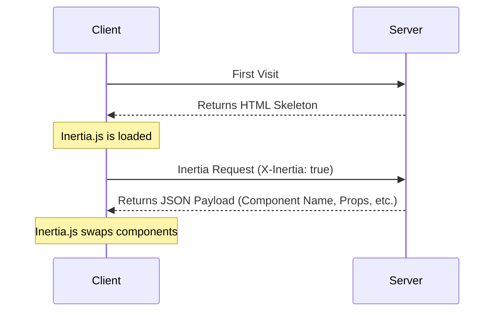

import V2UpgradeWarning from "/snippets/v2-upgrade-warning.mdx";

<V2UpgradeWarning />

Trang này chứa đặc tả chi tiết của giao thức Inertia. Trước tiên hãy đọc trang [cách Inertia hoạt động](/v2/core-concepts/how-it-works) để có cái nhìn tổng quan.

## Response HTML

Request đầu tiên đến một ứng dụng Inertia chỉ là request trình duyệt tải toàn bộ trang thông thường, không có header hoặc dữ liệu đặc biệt nào của Inertia. Với các request này, máy chủ trả về một tài liệu HTML đầy đủ.

Response HTML này bao gồm các asset của website (CSS, JavaScript) cùng root `<div>` trong body của trang. Root `<div>` đóng vai trò là điểm mount cho ứng dụng phía client và chứa thuộc tính `data-page` với [page object](#the-page-object) được mã hóa JSON cho trang ban đầu. Inertia dùng thông tin này để khởi động framework phía client và hiển thị page component đầu tiên.

```http
REQUEST
GET: https://example.com/events/80
Accept: text/html, application/xhtml+xml

RESPONSE
HTTP/1.1 200 OK
Content-Type: text/html; charset=utf-8

<html>
    <head>
        <title>My app</title>
        <link href="/css/app.css" rel="stylesheet">
        <script src="/js/app.js" defer></script>
    </head>
    <body>
        <div id="app" data-page='{"component":"Event","props":{"errors":{},"event":{"id":80,"title":"Birthday party","start_date":"2019-06-02","description":"Come out and celebrate Jonathan&apos;s 36th birthday party!"}},"url":"/events/80","version":"c32b8e4965f418ad16eaebba1d4e960f"}'></div>
    </body>
</html>
```

Mặc dù response ban đầu là HTML, Inertia không server-side render các page component JavaScript. Để biết thêm về server-side rendering, xem [tài liệu SSR](/v2/advanced/server-side-rendering).

## Response Inertia

Sau khi ứng dụng Inertia được khởi động, mọi request tiếp theo đến website đều được thực hiện qua XHR với header `X-Inertia` đặt thành `true`. Header này cho biết request được thực hiện bởi Inertia và không phải một lần tải toàn bộ trang thông thường.

Khi máy chủ phát hiện header `X-Inertia`, thay vì trả tài liệu HTML đầy đủ, nó trả response JSON chứa [page object](#the-page-object) đã được mã hóa.

```http
REQUEST
GET: https://example.com/events/80
Accept: text/html, application/xhtml+xml
X-Requested-With: XMLHttpRequest
X-Inertia: true
X-Inertia-Version: 6b16b94d7c51cbe5b1fa42aac98241d5

RESPONSE
HTTP/1.1 200 OK
Content-Type: application/json
Vary: X-Inertia
X-Inertia: true

{
    "component": "Event",
    "props": {
        "errors": {},
        "event": {
            "id": 80,
            "title": "Birthday party",
            "start_date": "2019-06-02",
            "description": "Come out and celebrate Jonathan's 36th birthday party!"
        }
    },
    "url": "/events/80",
    "version": "6b16b94d7c51cbe5b1fa42aac98241d5",
    "encryptHistory": true,
    "clearHistory": false
}
```

## Sơ đồ lifecycle của request

Sơ đồ bên dưới minh họa lifecycle của request trong một ứng dụng Inertia. Lần truy cập đầu tiên tạo một request tiêu chuẩn đến máy chủ, máy chủ trả về bộ khung ứng dụng HTML chứa root element với dữ liệu đã hydrate. Với các tương tác và điều hướng tiếp theo của người dùng, Inertia gửi request XHR nhận dữ liệu JSON. Inertia dùng response này để hydrate và thay đổi page component một cách động mà không cần tải lại toàn bộ trang.



## Request header

Các header sau được Inertia tự động gửi khi thực hiện request. Bạn không cần tự đặt chúng vì adapter phía client của Inertia đã xử lý.

<ParamField header="X-Inertia" type="boolean">
  Đặt thành `true` để chỉ ra đây là request Inertia.
</ParamField>

<ParamField header="X-Requested-With" type="string">
  Được đặt thành `XMLHttpRequest` trong mọi request Inertia.
</ParamField>

<ParamField header="Accept" type="string">
  Được đặt thành `text/html, application/xhtml+xml` để chỉ ra các loại response được chấp nhận.
</ParamField>

<ParamField header="X-Inertia-Version" type="string">
  Phiên bản asset hiện tại dùng để kiểm tra asset mismatch.
</ParamField>

<ParamField header="Purpose" type="string">
  Được đặt thành `prefetch` khi thực hiện request [prefetch](/v2/data-props/prefetching).
</ParamField>

<ParamField header="X-Inertia-Partial-Component" type="string">
  Tên component dành cho [partial reload](/v2/data-props/partial-reloads).
</ParamField>

<ParamField header="X-Inertia-Partial-Data" type="string">
  Danh sách props cần đưa vào partial reload, phân tách bằng dấu phẩy.
</ParamField>

<ParamField header="X-Inertia-Partial-Except" type="string">
  Danh sách props cần loại khỏi partial reload, phân tách bằng dấu phẩy.
</ParamField>

<ParamField header="X-Inertia-Reset" type="string">
  Danh sách props cần reset khi điều hướng, phân tách bằng dấu phẩy.
</ParamField>

<ParamField header="Cache-Control" type="string">
  Đặt thành `no-cache` cho request reload để tránh phục vụ nội dung đã cũ.
</ParamField>

<ParamField header="X-Inertia-Error-Bag" type="string">
  Chỉ định error bag dùng cho [lỗi validation](/v2/the-basics/validation).
</ParamField>

<ParamField header="X-Inertia-Infinite-Scroll-Merge-Intent" type="string">
  Cho biết dữ liệu được yêu cầu cần được nối vào cuối hay thêm vào đầu khi sử dụng [Infinite scroll](/v2/data-props/infinite-scroll).
</ParamField>

<ParamField header="X-Inertia-Except-Once-Props" type="string">
  Danh sách key [once prop](/v2/data-props/once-props) chưa hết hạn đã được tải ở client, phân tách bằng dấu phẩy. Máy chủ sẽ bỏ qua việc resolve các prop này trừ khi chúng được yêu cầu rõ ràng qua partial reload hoặc bị force refresh ở phía máy chủ.
</ParamField>

Các header sau được dùng cho request validation [Precognition](/v2/the-basics/forms#precognition).

<ParamField header="Precognition" type="boolean">
  Đặt thành `true` để cho biết đây là request validation Precognition.
</ParamField>

<ParamField header="Precognition-Validate-Only" type="string">
  Danh sách tên field cần validation, phân tách bằng dấu phẩy.
</ParamField>

## Response header

Các header sau cần được adapter phía máy chủ gửi trong response Inertia. Nếu dùng adapter chính thức, chúng được xử lý tự động.

<ParamField header="X-Inertia" type="boolean">
  Đặt thành `true` để cho biết đây là response Inertia.
</ParamField>

<ParamField header="X-Inertia-Location" type="string">
  Được dùng cho redirect bên ngoài khi response `409 Conflict` được trả về do asset version không khớp.
</ParamField>

<ParamField header="Vary" type="string">
  Đặt thành `X-Inertia` để giúp trình duyệt phân biệt chính xác response HTML và JSON.
</ParamField>

Các header sau được dùng cho response validation [Precognition](/v2/the-basics/forms#precognition).

<ParamField header="Precognition" type="string">
  Đặt thành `true` để cho biết đây là response validation Precognition.
</ParamField>

<ParamField header="Precognition-Success" type="string">
  Đặt thành `true` khi validation thành công và không có lỗi, kết hợp với status code `204 No Content`.
</ParamField>

<ParamField header="Vary" type="string">
  Đặt thành `Precognition` trong mọi response khi middleware Precognition được áp dụng.
</ParamField>

## Page object

Inertia chia sẻ dữ liệu giữa máy chủ và client thông qua page object. Object này chứa thông tin cần thiết để render page component, cập nhật history state của trình duyệt và theo dõi asset version của website. Page object có thể bao gồm các property sau:

<ParamField body="component" type="string">
  Tên của page component JavaScript.
</ParamField>

<ParamField body="props" type="object">
  Props của trang. Chứa toàn bộ dữ liệu trang cùng object `errors` (mặc định là `{}` nếu không có lỗi).
</ParamField>

<ParamField body="url" type="string">
  URL của trang.
</ParamField>

<ParamField body="version" type="string|number">
  [Asset version](/v2/advanced/asset-versioning) hiện tại.
</ParamField>

<ParamField body="encryptHistory" type="boolean">
  Có [mã hóa history state của trang hiện tại](/v2/security/history-encryption) hay không.
</ParamField>

<ParamField body="clearHistory" type="boolean">
  Có xóa [history state đã mã hóa](/v2/security/history-encryption#clearing-history) hay không.
</ParamField>

<ParamField body="mergeProps" type="array">
  Mảng key prop cần được [merge](/v2/data-props/merging-props) (nối vào cuối) trong quá trình điều hướng.
</ParamField>

<ParamField body="prependProps" type="array">
  Mảng key prop cần được [thêm vào đầu](/v2/data-props/merging-props) trong quá trình điều hướng.
</ParamField>

<ParamField body="deepMergeProps" type="array">
  Mảng key prop cần được [deep merge](/v2/data-props/merging-props#deep-merge) trong quá trình điều hướng.
</ParamField>

<ParamField body="matchPropsOn" type="array">
  Mảng key prop dùng để [đối sánh khi merge props](/v2/data-props/merging-props#matching-items).
</ParamField>

<ParamField body="scrollProps" type="object">
  Cấu hình hành vi merge prop cho [infinite scroll](/v2/data-props/infinite-scroll).
</ParamField>

<ParamField body="deferredProps" type="object">
  Cấu hình [lazy loading props](/v2/data-props/deferred-props) phía client.
</ParamField>

<ParamField body="onceProps" type="object">
  Cấu hình cho [once props](/v2/data-props/once-props), là các prop chỉ cần resolve một lần rồi tái sử dụng trên các trang tiếp theo. Mỗi entry ánh xạ một key đến object chứa tên `prop` và timestamp `expiresAt` tùy chọn (đơn vị mili giây).
</ParamField>

Trong các lần tải toàn bộ trang thông thường, page object được mã hóa JSON vào thuộc tính `data-page` của root `<div>`. Trong Inertia visit (được nhận biết bởi header `X-Inertia`), page object được trả về dưới dạng payload JSON.

### Page object cơ bản

Một page object tối thiểu chứa các property cốt lõi.

```json
{
    "component": "User/Edit",
    "props": {
        "errors": {},
        "user": {
            "name": "Jonathan"
        }
    },
    "url": "/user/123",
    "version": "6b16b94d7c51cbe5b1fa42aac98241d5",
    "clearHistory": false,
    "encryptHistory": false
}
```

### Page object với deferred props

Khi dùng deferred props, page object chứa cấu hình `deferredProps`. Lưu ý deferred props không có trong props ban đầu vì chúng được tải bằng request tiếp theo.

```json
{
    "component": "Posts/Index",
    "props": {
        "errors": {},
        "user": {
            "name": "Jonathan"
        }
    },
    "url": "/posts",
    "version": "6b16b94d7c51cbe5b1fa42aac98241d5",
    "clearHistory": false,
    "encryptHistory": false,
    "deferredProps": {
        "default": [
            "comments",
            "analytics"
        ],
        "sidebar": [
            "relatedPosts"
        ]
    }
}
```

### Page object với merge props

Khi dùng merge props, cấu hình bổ sung sẽ được đưa vào.

```json
{
    "component": "Feed/Index",
    "props": {
        "errors": {},
        "user": {
            "name": "Jonathan"
        },
        "posts": [
            {
                "id": 1,
                "title": "First Post"
            }
        ],
        "notifications": [
            {
                "id": 2,
                "message": "New comment"
            }
        ],
        "conversations": {
            "data": [
                {
                    "id": 1,
                    "title": "Support Chat",
                    "participants": [
                        "John",
                        "Jane"
                    ]
                }
            ]
        }
    },
    "url": "/feed",
    "version": "6b16b94d7c51cbe5b1fa42aac98241d5",
    "clearHistory": false,
    "encryptHistory": false,
    "mergeProps": [
        "posts"
    ],
    "prependProps": [
        "notifications"
    ],
    "deepMergeProps": [
        "conversations"
    ],
    "matchPropsOn": [
        "posts.id",
        "notifications.id",
        "conversations.data.id"
    ]
}
```

### Page object với scroll props

Khi dùng [Infinite scroll](/v2/data-props/infinite-scroll), page object chứa cấu hình `scrollProps`.

```json
{
    "component": "Posts/Index",
    "props": {
        "errors": {},
        "posts": {
            "data": [
                {
                    "id": 1,
                    "title": "First Post"
                },
                {
                    "id": 2,
                    "title": "Second Post"
                }
            ]
        }
    },
    "url": "/posts?page=1",
    "version": "6b16b94d7c51cbe5b1fa42aac98241d5",
    "clearHistory": false,
    "encryptHistory": false,
    "mergeProps": [
        "posts.data"
    ],
    "scrollProps": {
        "posts": {
            "pageName": "page",
            "previousPage": null,
            "nextPage": 2,
            "currentPage": 1
        }
    }
}
```

### Page object với once props

Khi dùng [once props](/v2/data-props/once-props), page object chứa cấu hình `onceProps`. Mỗi entry ánh xạ một key đến tên prop và timestamp hết hạn tùy chọn.

```json
{
    "component": "Billing/Plans",
    "props": {
        "errors": {},
        "plans": [
            {
                "id": 1,
                "name": "Basic"
            },
            {
                "id": 2,
                "name": "Pro"
            }
        ]
    },
    "url": "/billing/plans",
    "version": "6b16b94d7c51cbe5b1fa42aac98241d5",
    "clearHistory": false,
    "encryptHistory": false,
    "onceProps": {
        "plans": {
            "prop": "plans",
            "expiresAt": null
        }
    }
}
```

Khi điều hướng đến trang tiếp theo có cùng once prop, client gửi các key đã tải trong header `X-Inertia-Except-Once-Props`. Máy chủ bỏ qua việc resolve các prop này và không đưa chúng vào response. Client tái sử dụng các giá trị đã tải trước đó.

```http
REQUEST
GET: https://example.com/billing/upgrade
Accept: text/html, application/xhtml+xml
X-Requested-With: XMLHttpRequest
X-Inertia: true
X-Inertia-Version: 6b16b94d7c51cbe5b1fa42aac98241d5
X-Inertia-Except-Once-Props: plans

RESPONSE
HTTP/1.1 200 OK
Content-Type: application/json

{
    "component": "Billing/Upgrade",
    "props": {
        "errors": {},
        "currentPlan": {
            "id": 1,
            "name": "Basic"
        }
    },
    "url": "/billing/upgrade",
    "version": "6b16b94d7c51cbe5b1fa42aac98241d5",
    "clearHistory": false,
    "encryptHistory": false,
    "onceProps": {
        "plans": {
            "prop": "plans",
            "expiresAt": null
        }
    }
}
```

Lưu ý `plans` có trong `onceProps` nhưng không có trong `props` vì nó đã được tải ở client. Key `onceProps` dùng để nhận diện once prop xuyên suốt các trang, còn `prop` chỉ định tên prop thực tế. Hai giá trị có thể khác nhau khi dùng [custom key](/v2/data-props/once-props#custom-keys).

## Quản lý phiên bản asset

Một thách thức phổ biến của ứng dụng một trang là làm mới asset của website khi chúng thay đổi. Inertia giúp việc này dễ dàng bằng cách tùy chọn theo dõi phiên bản hiện tại của asset. Khi asset thay đổi, Inertia sẽ tự động thực hiện một lần tải toàn bộ trang thay vì visit XHR.

[Page object](#the-page-object) của Inertia chứa định danh `version`. Định danh này được thiết lập ở phía máy chủ và có thể là số, chuỗi, file hash hoặc bất kỳ giá trị nào đại diện cho "phiên bản" hiện tại của asset, miễn là giá trị thay đổi khi asset được cập nhật.

Mỗi khi request Inertia được thực hiện, Inertia gửi asset version hiện tại trong header `X-Inertia-Version`. Khi máy chủ nhận request, nó so sánh asset version được cung cấp trong header này với asset version hiện tại. Việc này thường được xử lý ở tầng middleware của framework phía máy chủ.

Nếu hai asset version giống nhau, request tiếp tục như bình thường. Nếu khác nhau, máy chủ lập tức trả response `409 Conflict` và đưa URL vào header `X-Inertia-Location`. Header này cần thiết vì có thể đã xảy ra redirect phía máy chủ. Nó cho Inertia biết URL đích cuối cùng dự kiến.

<Tip>
Lưu ý, response `409 Conflict` chỉ được gửi cho request `GET`, không gửi cho `POST/PUT/PATCH/DELETE`. Tuy nhiên, nó vẫn được gửi nếu một redirect `GET` xảy ra sau một trong các request này.
</Tip>

Khi client Inertia nhận response `409 Conflict`, nó kiểm tra header `X-Inertia-Location`. Nếu header tồn tại, Inertia thực hiện một lần tải toàn bộ trang đến URL được chỉ định. Điều này đảm bảo người dùng luôn tải asset mới nhất.

Nếu tồn tại dữ liệu session dạng "flash" khi response `409 Conflict` xảy ra, adapter framework phía máy chủ của Inertia sẽ tự động reflash dữ liệu này.

```http
REQUEST
GET: https://example.com/events/80
Accept: text/html, application/xhtml+xml
X-Requested-With: XMLHttpRequest
X-Inertia: true
X-Inertia-Version: 6b16b94d7c51cbe5b1fa42aac98241d5

RESPONSE
409: Conflict
X-Inertia-Location: https://example.com/events/80
```

Bạn có thể đọc thêm tại trang [quản lý phiên bản asset](/v2/advanced/asset-versioning).

## Tải lại một phần

Khi thực hiện request Inertia, tùy chọn partial reload cho phép chỉ yêu cầu một tập con props (dữ liệu) từ máy chủ trong các lần truy cập tiếp theo đến *cùng* page component. Đây có thể là cách tối ưu hiệu năng hữu ích nếu chấp nhận một phần dữ liệu trang trở nên cũ. Xem tài liệu [partial reload](/v2/data-props/partial-reloads) để biết chi tiết.

Khi request partial reload được thực hiện, Inertia gửi header `X-Inertia-Partial-Component` và có thể gửi thêm `X-Inertia-Partial-Data` và/hoặc `X-Inertia-Partial-Except`.

Header `X-Inertia-Partial-Data` là danh sách key props (dữ liệu) mong muốn được trả về, phân tách bằng dấu phẩy.

Header `X-Inertia-Partial-Except` là danh sách key props (dữ liệu) không được trả về, phân tách bằng dấu phẩy. Khi chỉ có header `X-Inertia-Partial-Except`, tất cả props trừ các prop được liệt kê sẽ được gửi. Nếu có cả `X-Inertia-Partial-Data` và `X-Inertia-Partial-Except`, header `X-Inertia-Partial-Except` được ưu tiên.

Header `X-Inertia-Partial-Component` chứa tên component đang được partial reload. Điều này cần thiết vì partial reload chỉ hoạt động với request đến cùng page component. Nếu đích cuối khác đi vì lý do nào đó (ví dụ người dùng đã đăng xuất và hiện ở trang đăng nhập), partial reload sẽ không diễn ra.

```http
REQUEST
GET: https://example.com/events
Accept: text/html, application/xhtml+xml
X-Requested-With: XMLHttpRequest
X-Inertia: true
X-Inertia-Version: 6b16b94d7c51cbe5b1fa42aac98241d5
X-Inertia-Partial-Data: events
X-Inertia-Partial-Component: Events

RESPONSE
HTTP/1.1 200 OK
Content-Type: application/json

{
    "component": "Events",
    "props": {
        "auth": {...},       // NOT included
        "categories": [...], // NOT included
        "events": [...],     // Included
        "errors": {}         // ALWAYS included
    },
    "url": "/events/80",
    "version": "6b16b94d7c51cbe5b1fa42aac98241d5"
}
```

## HTTP status code

Inertia sử dụng các HTTP status code cụ thể để xử lý những tình huống khác nhau.

| Status Code         | Mô tả                                                                                                                                                                                                 |
|:--------------------|:------------------------------------------------------------------------------------------------------------------------------------------------------------------------------------------------------------|
| **200 OK**          | Response thành công tiêu chuẩn cho cả HTML và response JSON Inertia.                                                                                                                                   |
| **302 Found**       | Response redirect tiêu chuẩn. Adapter phía máy chủ của Inertia tự động chuyển thành `303 See Other` khi được trả sau request `PUT`, `PATCH` hoặc `DELETE`.                                        |
| **303 See Other**   | Dùng cho redirect sau request không phải GET. Status code này yêu cầu trình duyệt gửi request `GET` đến URL redirect, ngăn việc submit form trùng lặp có thể xảy ra nếu trình duyệt lặp lại HTTP method ban đầu. |
| **409 Conflict**    | Được trả về khi asset version không khớp hoặc khi redirect ra bên ngoài. Với asset mismatch, nó kích hoạt tải lại toàn bộ trang. Với external redirect, response chứa header `X-Inertia-Location` và kích hoạt redirect `window.location` ở client. |

Các status code sau được dùng cho request validation [Precognition](/v2/the-basics/forms#precognition).

| Status Code                   | Mô tả                                                                                     |
|:------------------------------|:------------------------------------------------------------------------------------------------|
| **204 No Content**            | Request validation Precognition thành công và không có lỗi validation.                           |
| **422 Unprocessable Entity**  | Request validation Precognition có lỗi validation. Response body chứa các lỗi.  |
