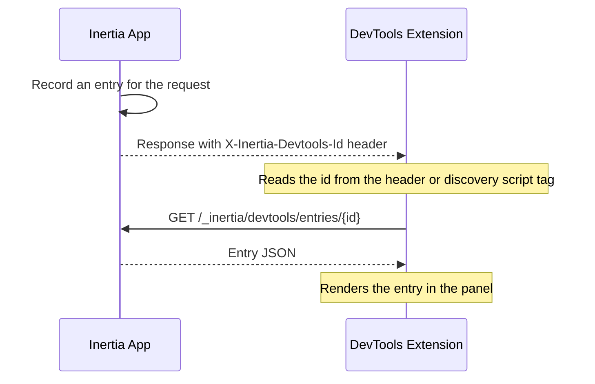

This page contains a detailed specification of the Inertia DevTools protocol. Be sure to read the [DevTools](/v3/advanced/devtools) page first for a high-level overview of the feature.

The DevTools extension is backend-agnostic. Any server-side Inertia adapter may integrate with it by implementing this protocol. The reference implementation is the Laravel adapter, and nothing in this specification is Laravel-specific.

The protocol has three layers:

1. **Discovery**, how the extension learns an entry was recorded.
2. **Correlation headers**, request and response headers that correlate and group entries.
3. **Read API**, the endpoints the extension calls to fetch recorded entries, along with the entry format they return.

A conforming adapter records one entry per HTTP request it handles, stores it keyed by a generated id and scoped per browser tab, and exposes it through the read API. The extension fetches each entry out of band rather than reading it from the app's response, so recording never alters the payload your application actually returns.



## Discovery

For every response, the adapter generates a unique entry id (any collision-resistant string, such as a ULID) and sets it on a response header.

<ParamField header="X-Inertia-Devtools-Id" type="string">
  The generated id for this entry, set on every response. The extension learns the id from this header, then fetches the entry from the [read API](#the-read-api).
</ParamField>

The header alone is not enough for the first document load, which the extension observes through the DOM rather than `fetch`. On the initial full-page HTML response, also inject a script tag so the extension may read the id before any XHR occurs.

```html
<script data-inertia-devtools-id type="application/json">"<id>"</script>
```

The tag content is the JSON-encoded id string.

## Correlation Headers

These headers correlate entries with client-side page state and group related requests. The extension stamps the request headers, and the adapter reads them and stores their values on the entry. The adapter emits the response header.

The following request headers are sent by the extension, all optional per request.

<ParamField header="X-Inertia-Devtools-Tab" type="string">
  Per-tab UUID, stored as `__meta.tabUuid`. Used to scope stored entries so one tab's history does not evict another's.
</ParamField>

<ParamField header="X-Inertia-Devtools-Visit" type="string">
  Client visit id, stored as `__meta.visitId`. Lets the extension pair the entry with the browser-side page snapshot.
</ParamField>

<ParamField header="X-Inertia-Devtools-Parent" type="string">
  Id of the entry that started this batch, stored as `__meta.batchId`. Stored verbatim, grouping is a client concern.
</ParamField>

<ParamField header="X-Inertia-Devtools-Deferred" type="string">
  Present (`1`) when this is a [deferred-prop](/v3/data-props/deferred-props) follow-up. Wire-indistinguishable from a [partial reload](/v3/data-props/partial-reloads), so the client declares the intent.
</ParamField>

<ParamField header="X-Inertia-Devtools-Poll" type="string">
  Present (`1`) when this is a [polling](/v3/data-props/polling) tick, also wire-indistinguishable from a partial reload.
</ParamField>

The following response header is emitted by the adapter.

<ParamField header="X-Inertia-Devtools-Parent-Out" type="string">
  The batch root id (the `batchId` of this request, or this entry's own `id` when it starts a batch). The client forwards this value as `X-Inertia-Devtools-Parent` on the next same-batch request. Pointing every follow-up at the root keeps a batch flat, and hands the true root down across a redirect so the post-redirect request attaches to the batch root rather than the throwaway redirect hop. A [prefetch](/v3/data-props/prefetching) response returns its own `id` instead, since a prefetch is speculative and must not advance the batch cursor for unrelated traffic.
</ParamField>

An adapter should set this header on every response. Omitting it degrades batching, since the client then falls back to the response's own `X-Inertia-Devtools-Id`, so each request chains to the previous response rather than the batch root and redirects may group less precisely.

## The Read API

Two authenticated endpoints, gated so they are reachable only in development or by an authorized developer. The paths are fixed.

**`GET /_inertia/devtools/entries/{id}`** returns a single [entry](#the-entry-format) as JSON, or `404` if the id is unknown. This is the only endpoint the extension currently calls. It learns an id from discovery or the response header, then fetches that one entry.

**`GET /_inertia/devtools/entries`** returns a JSON array of entries, newest first. The extension does not call it yet, so it is optional. It exists for tooling that lists a tab's history. An adapter may implement these optional query filters: `component` (exact component name to keep), `type` and `exclude` (comma-separated `requestType` lists to keep or drop), `offset`, and `limit`. A minimal adapter may ignore them and return the full buffer.

Requests are made with credentials (same-origin cookies) so the adapter may authorize them.

## The Entry Format

An entry is a JSON object. Fields are split into two tiers.

Required fields must be emitted for the panel to function. Where a value is genuinely absent, the adapter emits the documented empty or null form rather than omitting the key.

Optional fields are enhancement data. An adapter may emit `null`, `{}`, or omit them, and the panel degrades gracefully, for example hiding "open in editor" links when source locations are absent.

Adding fields beyond this specification is safe. The extension ignores unknown fields rather than rejecting the entry.

A fully-populated entry for a standard navigation looks like this.

```json
{
    "__meta": {
        "id": "01JADEVTOOLS0000000000000",
        "tabUuid": "tab-abc",
        "batchId": null,
        "timestamp": "2026-07-09T10:00:00.000Z",
        "utime": 1783591200.123,
        "method": "GET",
        "url": "http://localhost/users",
        "component": "Users/Index",
        "requestType": "navigate",
        "status": 200,
        "redirectLocation": null,
        "serverTimingMs": 12.5,
        "visitId": "visit-1"
    },
    "http": {
        "requestHeaders": { "x-inertia": "true" },
        "responseHeaders": { "content-type": "application/json" },
        "requestBody": { "status": "empty" },
        "responseBody": {
            "status": "present",
            "value": {
                "component": "Users/Index",
                "props": { "name": "Alice" },
                "flash": { "message": "User created" }
            }
        }
    },
    "props": {
        "name": { "shared": false },
        "errors": { "inertiaType": "always", "shared": true, "shareSource": { "file": "Middleware.php", "line": 72 } }
    },
    "propValues": { "name": "Alice", "errors": {} },
    "route": {
        "name": "users.index",
        "uri": "/users",
        "action": "App\\Http\\Controllers\\UsersController@index",
        "actionSource": { "file": "UsersController.php", "line": 15 }
    },
    "renderSource": { "file": "UsersController.php", "line": 17 },
    "componentPath": "resources/js/Pages/Users/Index.vue"
}
```

The fields are detailed below.

### Meta

The `__meta` object carries the entry's identity and summary.

<ParamField body="id" type="string" required>
  Matches the `X-Inertia-Devtools-Id` for this response.
</ParamField>

<ParamField body="method" type="string" required>
  HTTP method.
</ParamField>

<ParamField body="url" type="string" required>
  Absolute request URL.
</ParamField>

<ParamField body="status" type="number" required>
  HTTP status code.
</ParamField>

<ParamField body="requestType" type="string" required>
  One of the [request types](#request-type-derivation).
</ParamField>

<ParamField body="component" type="string | null" required>
  Inertia page component, `null` for non-Inertia (raw HTTP) responses.
</ParamField>

<ParamField body="timestamp" type="string" required>
  ISO 8601, used for display.
</ParamField>

<ParamField body="utime" type="number" required>
  Float seconds since epoch, used for stable ordering.
</ParamField>

<ParamField body="tabUuid" type="string | null" required>
  From `X-Inertia-Devtools-Tab`, `null` on the initial full-page load, which carries no tab header yet.
</ParamField>

<ParamField body="batchId" type="string | null" required>
  From `X-Inertia-Devtools-Parent`, `null` starts a new batch.
</ParamField>

<ParamField body="serverTimingMs" type="number | null" required>
  Server processing time in milliseconds, `null` when unavailable.
</ParamField>

<ParamField body="redirectLocation" type="string | null">
  Redirect target for `3xx` and Inertia location responses.
</ParamField>

<ParamField body="visitId" type="string | null">
  From `X-Inertia-Devtools-Visit`.
</ParamField>

<Note>
`timestamp` and `utime` describe the same instant in two forms: `timestamp` keeps a stored entry readable on its own, while `utime` carries sub-millisecond precision and is the key the panel orders and groups by. Adapters emit both, derived from the same instant.
</Note>

### HTTP

The `http` object is required, and each sub-key is required (use the empty forms when there is nothing to show).

```ts
http: {
    requestHeaders:  Record<string, string>   // may be {}
    responseHeaders: Record<string, string>   // may be {}
    requestBody:     BodyCapture
    responseBody:    BodyCapture
}
```

`BodyCapture` is a tagged union.

```ts
| { status: 'empty' }
| { status: 'present', value: <json tree or raw string> }
| { status: 'omitted', reason: string }
```

`value` is a string for raw textual bodies, otherwise a decoded JSON value. Recognized `omitted` reasons are `non-inertia-response`, `non-inertia-request`, `non-textual`, `streamed`, `too-large`, `unserializable`, and `binary`. The panel maps these to friendly notices, and an unknown reason falls back to a generic message, so new reasons are safe. Adapters redact sensitive keys and summarize file uploads rather than serializing binary content.

### Props

<ParamField body="props" type="Record<string, PropMeta>" required>
  Per-prop metadata, keyed by dotted path. May be `{}` when the adapter cannot classify props; the panel then renders values only.

  <Expandable title="PropMeta">
    Every field is optional. Source locations are `{ file: string, line: number }`.

    <ParamField body="inertiaType" type="'always' | 'defer' | 'optional' | 'merge' | 'scroll' | 'once'" />
    <ParamField body="shared" type="boolean">
      Whether the prop was [shared](/v3/data-props/shared-data) rather than returned from the controller.
    </ParamField>
    <ParamField body="deferGroup" type="string" />
    <ParamField body="reset" type="boolean" />
    <ParamField body="once" type="boolean">
      Set for a [once prop](/v3/data-props/once-props), loaded a single time and reused on later visits.
    </ParamField>
    <ParamField body="mergeDirection" type="'append' | 'prepend'">
      How a [merge](/v3/data-props/merging-props) or [scroll](/v3/data-props/infinite-scroll) prop combines with existing client data.
    </ParamField>
    <ParamField body="deepMerge" type="boolean">
      Set alongside `mergeDirection` for a deep merge.
    </ParamField>
    <ParamField body="rescued" type="boolean">
      A deferred prop whose resolver threw but was rescued, so the prop carries no value on this response.
    </ParamField>
    <ParamField body="renderSource" type="{ file, line }" />
    <ParamField body="shareSource" type="{ file, line }" />
  </Expandable>
</ParamField>

<ParamField body="propValues" type="Record<string, unknown>">
  Resolved prop values, keyed by dotted path. Sensitive values are replaced with `"[REDACTED]"`. May be omitted or `{}`. The panel guards against absence.
</ParamField>

### Route

<ParamField body="route.uri" type="string" required>
  Matched route path, `""` if none.
</ParamField>

<ParamField body="route.name" type="string | null" required>
  Route name, `null` when the route is unnamed.
</ParamField>

<ParamField body="route.action" type="string | null" required>
  Controller or handler identifier, `null` when none applies.
</ParamField>

<ParamField body="route.actionSource" type="{ file, line }">
  Handler source location.
</ParamField>

<ParamField body="renderSource" type="{ file, line } | null" required>
  Where the page render was invoked, `null` when it cannot be resolved.
</ParamField>

<ParamField body="componentPath" type="string | null" required>
  Resolved path of the component file, `null` when it cannot be resolved.
</ParamField>

Source-location fields power the "open in editor" links. Adapters that cannot cheaply resolve them emit `null` and lose only those links.

## Request Type Derivation

The type is derived from headers the adapter already sees, plus the two DevTools hint headers. Evaluate in this order and take the first match.

| Order | Condition | Request type |
| --- | --- | --- |
| 1 | [Precognition](/v3/the-basics/forms#precognition) header present | `precognition` |
| 2 | Not an Inertia request, and an Inertia page was rendered (component present) | `initial` |
| 3 | Not an Inertia request, and no Inertia page was rendered | `http` |
| 4 | `X-Inertia-Devtools-Deferred` present | `deferred` |
| 5 | `X-Inertia-Devtools-Poll` present | `poll` |
| 6 | Partial-reload header present (`X-Inertia-Partial-Component`) | `partial` |
| 7 | Prefetch (`Purpose: prefetch`) | `prefetch` |
| 8 | Otherwise | `navigate` |

`initial` and `http` are both non-Inertia requests, and the adapter distinguishes them by whether it rendered an Inertia page. The app's initial full-page load renders a page (so `component` is set) and is `initial`, while a plain JSON or text endpoint the app serves alongside Inertia renders no page (so `component` is `null`) and is `http`. The adapter already knows which it produced, so it classifies once on the wire rather than leaving the panel to re-derive it.

The `client-visit` and `cache-hit` types are client-only and never come from an adapter.

## Storage Semantics

An adapter buffers recent entries and evicts old ones, typically capping entries per `tabUuid` so a busy tab cannot evict another tab's history, and pruning entries past a TTL. These are adapter-internal concerns; the protocol only requires that the read API return what is currently stored, newest first.
