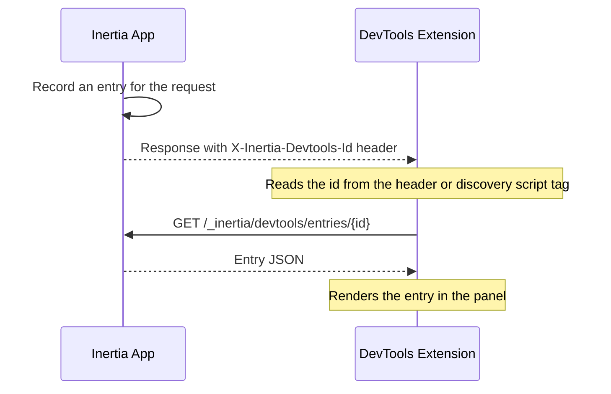

Trang này chứa đặc tả chi tiết Inertia DevTools protocol. Hãy đọc trang [DevTools](/v3/advanced/devtools) trước để có tổng quan cấp cao về tính năng.

DevTools extension không phụ thuộc backend. Bất kỳ server-side Inertia adapter nào cũng có thể tích hợp bằng cách triển khai protocol này. Implementation tham chiếu là Laravel adapter và không có nội dung nào trong đặc tả phụ thuộc Laravel.

Protocol có ba lớp:

1. **Discovery** - cách extension biết một entry đã được ghi nhận.
2. **Correlation headers** - request/response header dùng để correlate và group entry.
3. **Read API** - endpoint extension gọi để lấy recorded entry cùng định dạng entry trả về.

Adapter tuân thủ protocol ghi một entry cho mỗi HTTP request nó xử lý, lưu theo generated id và scope theo browser tab, rồi expose qua read API. Extension fetch từng entry out-of-band thay vì đọc từ response của app, vì vậy recording không bao giờ thay đổi payload thực tế ứng dụng trả về.



## Discovery

Với mỗi response, adapter tạo entry id duy nhất (bất kỳ chuỗi chống collision như ULID) và đặt nó vào response header.

<ParamField header="X-Inertia-Devtools-Id" type="string">
  Generated id của entry này được đặt trên mọi response. Extension lấy id từ header rồi fetch entry từ [read API](#the-read-api).
</ParamField>

Chỉ header là chưa đủ cho lần document load đầu tiên, vốn được extension quan sát qua DOM thay vì `fetch`. Trên initial full-page HTML response, hãy inject thêm script tag để extension đọc id trước khi XHR xảy ra.

```html
<script data-inertia-devtools-id type="application/json">"<id>"</script>
```

Nội dung tag là chuỗi id được JSON encode.

## Correlation headers

Các header này correlate entry với client-side page state và group request liên quan. Extension đóng dấu request header; adapter đọc và lưu giá trị vào entry. Adapter phát response header.

Các request header sau do extension gửi, tất cả đều tùy chọn theo từng request.

<ParamField header="X-Inertia-Devtools-Tab" type="string">
  UUID theo tab, lưu dưới `__meta.tabUuid`. Dùng để scope stored entry để history của tab này không evict tab khác.
</ParamField>

<ParamField header="X-Inertia-Devtools-Visit" type="string">
  Client visit id, lưu dưới `__meta.visitId`. Cho phép extension ghép entry với browser-side page snapshot.
</ParamField>

<ParamField header="X-Inertia-Devtools-Parent" type="string">
  Id của entry bắt đầu batch này, lưu dưới `__meta.batchId`. Được lưu nguyên trạng; grouping là trách nhiệm của client.
</ParamField>

<ParamField header="X-Inertia-Devtools-Deferred" type="string">
  Có mặt (`1`) khi đây là follow-up của [deferred prop](/v3/data-props/deferred-props). Trên wire không phân biệt được với [partial reload](/v3/data-props/partial-reloads), nên client khai báo intent.
</ParamField>

<ParamField header="X-Inertia-Devtools-Poll" type="string">
  Có mặt (`1`) khi đây là tick [polling](/v3/data-props/polling), cũng không phân biệt được với partial reload trên wire.
</ParamField>

Response header sau do adapter phát ra.

<ParamField header="X-Inertia-Devtools-Parent-Out" type="string">
  Batch root id (`batchId` của request này, hoặc `id` của chính entry khi nó bắt đầu batch). Client forward giá trị này thành `X-Inertia-Devtools-Parent` trong request cùng batch tiếp theo. Việc mọi follow-up đều trỏ tới root giúp batch phẳng, đồng thời truyền root thực sự qua redirect để post-redirect request gắn vào batch root thay vì hop redirect tạm. Response [prefetch](/v3/data-props/prefetching) trả `id` riêng vì prefetch là speculative và không được tiến batch cursor cho traffic không liên quan.
</ParamField>

Adapter nên đặt header này trên mọi response. Bỏ nó làm giảm chất lượng batching vì client fallback về `X-Inertia-Devtools-Id` của chính response, khiến mỗi request chain tới response trước thay vì batch root và redirect có thể group kém chính xác.

## Read API

Hai endpoint có authentication, được gate để chỉ truy cập trong development hoặc bởi developer đã được authorize. Path là cố định.

**`GET /_inertia/devtools/entries/{id}`** trả một [entry](#the-entry-format) dưới dạng JSON hoặc `404` nếu id không tồn tại. Đây là endpoint duy nhất extension hiện gọi. Nó lấy id từ discovery hoặc response header rồi fetch entry đó.

**`GET /_inertia/devtools/entries`** trả mảng JSON entry theo thứ tự mới nhất trước. Extension hiện chưa gọi nên endpoint này là tùy chọn. Nó tồn tại cho tooling liệt kê history của tab. Adapter có thể hỗ trợ các query filter tùy chọn: `component` (giữ exact component name), `type` và `exclude` (danh sách `requestType` phân tách dấu phẩy để giữ hoặc loại), `offset`, `limit`. Adapter tối thiểu có thể bỏ qua filter và trả toàn bộ buffer.

Request được gửi kèm credential (same-origin cookie) để adapter có thể authorize.

## Định dạng Entry

Entry là JSON object. Các field được chia thành hai tầng.

Các field bắt buộc phải được phát để panel hoạt động. Khi giá trị thực sự không tồn tại, adapter phát dạng rỗng hoặc null theo tài liệu thay vì bỏ key.

Field tùy chọn là dữ liệu bổ sung. Adapter có thể phát `null`, `{}` hoặc bỏ qua; panel vẫn degrade gracefully, ví dụ ẩn link "open in editor" khi không có source location.

Có thể thêm field ngoài đặc tả này một cách an toàn. Extension bỏ qua field không nhận biết thay vì từ chối entry.

Một entry đầy đủ cho navigation tiêu chuẩn có dạng sau.

```json
{
    "__meta": {
        "id": "01JADEVTOOLS0000000000000",
        "tabUuid": "tab-abc",
        "batchId": null,
        "timestamp": "2026-07-09T10:00:00.000Z",
        "utime": 1783591200.123,
        "method": "GET",
        "url": "http://localhost/users",
        "component": "Users/Index",
        "requestType": "navigate",
        "status": 200,
        "redirectLocation": null,
        "serverTimingMs": 12.5,
        "visitId": "visit-1"
    },
    "http": {
        "requestHeaders": { "x-inertia": "true" },
        "responseHeaders": { "content-type": "application/json" },
        "requestBody": { "status": "empty" },
        "responseBody": {
            "status": "present",
            "value": {
                "component": "Users/Index",
                "props": { "name": "Alice" },
                "flash": { "message": "User created" }
            }
        }
    },
    "props": {
        "name": { "shared": false },
        "errors": { "inertiaType": "always", "shared": true, "shareSource": { "file": "Middleware.php", "line": 72 } }
    },
    "propValues": { "name": "Alice", "errors": {} },
    "route": {
        "name": "users.index",
        "uri": "/users",
        "action": "App\\Http\\Controllers\\UsersController@index",
        "actionSource": { "file": "UsersController.php", "line": 15 }
    },
    "renderSource": { "file": "UsersController.php", "line": 17 },
    "componentPath": "resources/js/Pages/Users/Index.vue"
}
```

Chi tiết các field được mô tả bên dưới.

### Meta

Object `__meta` chứa identity và summary của entry.

<ParamField body="id" type="string" required>
  Khớp với `X-Inertia-Devtools-Id` của response này.
</ParamField>

<ParamField body="method" type="string" required>
  HTTP method.
</ParamField>

<ParamField body="url" type="string" required>
  Request URL tuyệt đối.
</ParamField>

<ParamField body="status" type="number" required>
  HTTP status code.
</ParamField>

<ParamField body="requestType" type="string" required>
  Một trong các [request type](#request-type-derivation).
</ParamField>

<ParamField body="component" type="string | null" required>
  Inertia page component, `null` với response không phải Inertia (raw HTTP).
</ParamField>

<ParamField body="timestamp" type="string" required>
  ISO 8601, dùng để hiển thị.
</ParamField>

<ParamField body="utime" type="number" required>
  Số giây dạng float từ epoch, dùng để sắp xếp ổn định.
</ParamField>

<ParamField body="tabUuid" type="string | null" required>
  Từ `X-Inertia-Devtools-Tab`, `null` ở lần full-page load đầu tiên vì lúc đó chưa có tab header.
</ParamField>

<ParamField body="batchId" type="string | null" required>
  Từ `X-Inertia-Devtools-Parent`; `null` bắt đầu batch mới.
</ParamField>

<ParamField body="serverTimingMs" type="number | null" required>
  Thời gian xử lý phía server tính bằng millisecond, `null` nếu không có.
</ParamField>

<ParamField body="redirectLocation" type="string | null">
  Redirect target cho response `3xx` và Inertia location.
</ParamField>

<ParamField body="visitId" type="string | null">
  Từ `X-Inertia-Devtools-Visit`.
</ParamField>

<Note>
`timestamp` và `utime` mô tả cùng một thời điểm dưới hai dạng: `timestamp` giúp stored entry tự đọc được, còn `utime` mang độ chính xác dưới millisecond và là key panel dùng để sắp xếp, group. Adapter phát cả hai từ cùng một thời điểm.
</Note>

### HTTP

Object `http` là bắt buộc và mỗi sub-key cũng bắt buộc; dùng dạng rỗng khi không có gì để hiển thị.

```ts
http: {
    requestHeaders:  Record<string, string>   // may be {}
    responseHeaders: Record<string, string>   // may be {}
    requestBody:     BodyCapture
    responseBody:    BodyCapture
}
```

`BodyCapture` là tagged union.

```ts
| { status: 'empty' }
| { status: 'present', value: <json tree or raw string> }
| { status: 'omitted', reason: string }
```

`value` là chuỗi với raw textual body, còn trường hợp khác là JSON value đã decode. Các reason `omitted` được nhận biết gồm `non-inertia-response`, `non-inertia-request`, `non-textual`, `streamed`, `too-large`, `unserializable` và `binary`. Panel ánh xạ chúng thành thông báo thân thiện; reason không biết fallback về message chung nên có thể thêm reason mới an toàn. Adapter redact key nhạy cảm và tóm tắt file upload thay vì serialize nội dung binary.

### Props

<ParamField body="props" type="Record<string, PropMeta>" required>
  Metadata theo từng prop, key là dotted path. Có thể là `{}` nếu adapter không phân loại được prop; khi đó panel chỉ render value.

  <Expandable title="PropMeta">
    Mọi field đều tùy chọn. Source location có dạng `{ file: string, line: number }`.

    <ParamField body="inertiaType" type="'always' | 'defer' | 'optional' | 'merge' | 'scroll' | 'once'" />
    <ParamField body="shared" type="boolean">
      Cho biết prop được [share](/v3/data-props/shared-data) thay vì trả từ controller.
    </ParamField>
    <ParamField body="deferGroup" type="string" />
    <ParamField body="reset" type="boolean" />
    <ParamField body="once" type="boolean">
      Được đặt cho [once prop](/v3/data-props/once-props), chỉ tải một lần và tái sử dụng ở visit sau.
    </ParamField>
    <ParamField body="mergeDirection" type="'append' | 'prepend'">
      Cách [merge](/v3/data-props/merging-props) hoặc [scroll](/v3/data-props/infinite-scroll) prop kết hợp với dữ liệu hiện có phía client.
    </ParamField>
    <ParamField body="deepMerge" type="boolean">
      Được đặt cùng `mergeDirection` cho deep merge.
    </ParamField>
    <ParamField body="rescued" type="boolean">
      Deferred prop có resolver ném exception nhưng được rescue, nên prop không mang value trong response này.
    </ParamField>
    <ParamField body="renderSource" type="{ file, line }" />
    <ParamField body="shareSource" type="{ file, line }" />
  </Expandable>
</ParamField>

<ParamField body="propValues" type="Record<string, unknown>">
  Giá trị prop đã resolve, key theo dotted path. Giá trị nhạy cảm được thay bằng `"[REDACTED]"`. Có thể bị bỏ hoặc là `{}`; panel tự xử lý khi vắng mặt.
</ParamField>

### Route

<ParamField body="route.uri" type="string" required>
  Matched route path, `""` nếu không có.
</ParamField>

<ParamField body="route.name" type="string | null" required>
  Route name, `null` khi route không có tên.
</ParamField>

<ParamField body="route.action" type="string | null" required>
  Định danh controller hoặc handler, `null` khi không áp dụng.
</ParamField>

<ParamField body="route.actionSource" type="{ file, line }">
  Source location của handler.
</ParamField>

<ParamField body="renderSource" type="{ file, line } | null" required>
  Nơi page render được gọi, `null` khi không resolve được.
</ParamField>

<ParamField body="componentPath" type="string | null" required>
  Path đã resolve của component file, `null` khi không resolve được.
</ParamField>

Các field source-location cung cấp link "open in editor". Adapter không thể resolve chúng với chi phí hợp lý có thể phát `null` và chỉ mất các link này.

## Xác định Request Type

Type được suy ra từ các header adapter vốn đã thấy, cộng hai DevTools hint header. Đánh giá theo thứ tự này và lấy match đầu tiên.

| Thứ tự | Điều kiện | Request type |
| --- | --- | --- |
| 1 | Có header [Precognition](/v3/the-basics/forms#precognition) | `precognition` |
| 2 | Không phải Inertia request và có render Inertia page (có component) | `initial` |
| 3 | Không phải Inertia request và không render Inertia page | `http` |
| 4 | Có `X-Inertia-Devtools-Deferred` | `deferred` |
| 5 | Có `X-Inertia-Devtools-Poll` | `poll` |
| 6 | Có partial-reload header (`X-Inertia-Partial-Component`) | `partial` |
| 7 | Prefetch (`Purpose: prefetch`) | `prefetch` |
| 8 | Trường hợp khác | `navigate` |

`initial` và `http` đều là request không phải Inertia; adapter phân biệt bằng việc nó có render Inertia page hay không. Initial full-page load của app render page nên `component` được đặt và type là `initial`; endpoint JSON/text thông thường chạy cạnh Inertia không render page nên `component` là `null` và type là `http`. Adapter đã biết mình tạo loại nào nên phân loại ngay trên wire thay vì để panel suy luận lại.

Type `client-visit` và `cache-hit` chỉ tồn tại phía client và không bao giờ đến từ adapter.

## Ngữ nghĩa lưu trữ

Adapter buffer các entry gần đây và evict entry cũ, thường giới hạn số entry theo `tabUuid` để tab bận không đẩy mất history của tab khác, đồng thời prune entry quá TTL. Đây là chi tiết nội bộ adapter; protocol chỉ yêu cầu read API trả những gì hiện đang lưu, mới nhất trước.
