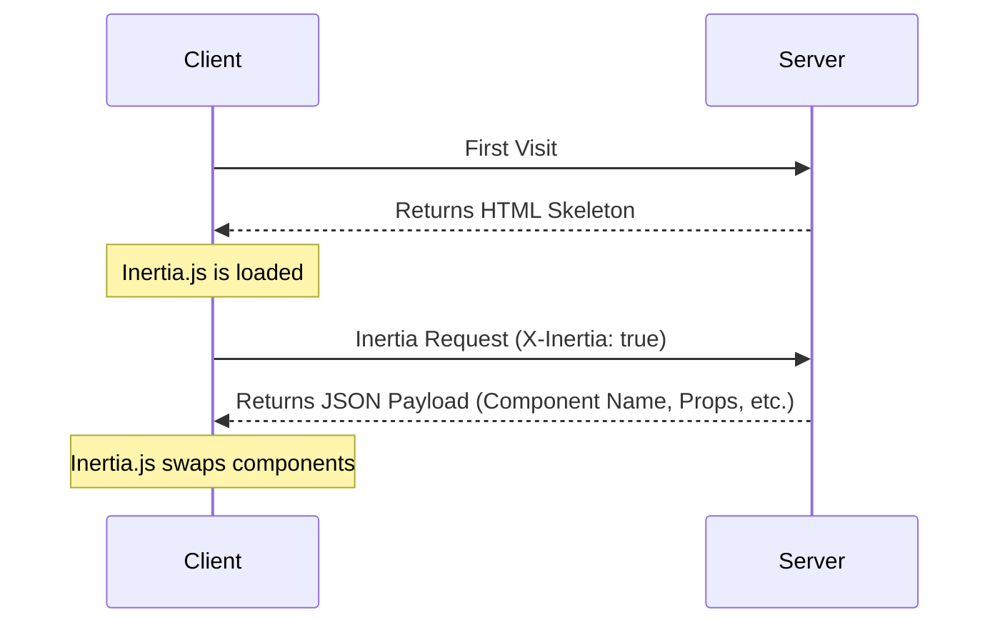

This page specifies the Inertia protocol: the exact wire contract between an Inertia client and your server. Read the [how it works](/v3/core-concepts/how-it-works) page first for a high-level overview.

The protocol is framework-agnostic. Any backend that speaks HTTP may implement it, so you may build a new server-side adapter against it in any language. The official Laravel adapter serves as the reference implementation throughout this page, and every request and response below is real and copy-pasteable.

## HTML Responses

The very first request to an Inertia app is just a regular, full-page browser request, with no special Inertia headers or data. For these requests, the server returns a full HTML document.

This HTML response includes the site assets (CSS, JavaScript) as well as a root `<div>` in the page's body. The root `<div>` serves as a mounting point for the client-side app. A `<script type="application/json">` element contains the JSON-encoded [page object](#the-page-object) for the initial page. Inertia uses this information to boot your client-side framework and display the initial page component.

```http
REQUEST
GET: https://example.com/events/80
Accept: text/html, application/xhtml+xml

RESPONSE
HTTP/1.1 200 OK
Content-Type: text/html; charset=utf-8

<html>
    <head>
        <title>My app</title>
        <link href="/css/app.css" rel="stylesheet">
        <script src="/js/app.js" defer></script>
    </head>
    <body>
        <script data-page="app" type="application/json">{"component":"Event","props":{"errors":{},"event":{"id":80,"title":"Birthday party","start_date":"2019-06-02","description":"Come out and celebrate Jonathan's 36th birthday party!"}},"url":"\/events\/80","version":"c32b8e4965f418ad16eaebba1d4e960f"}</script>
        <div id="app"></div>
    </body>
</html>
```

<Warning>
  The embedded page object is printed inside a `<script>` tag, so its serialized JSON MUST escape every forward slash (`/` becomes `\/`), which is why the example above contains `"\/events\/80"`. This prevents a `</script>` sequence inside your prop data from closing the script element early and breaking the page. HTML-entity encoding MUST NOT be used here, since the browser does not decode entities inside a script body and JSON parsing would then fail.
</Warning>

## Inertia Responses

Once the Inertia app has been booted, all subsequent requests to the site are made via XHR with a `X-Inertia` header set to `true`. This header indicates that the request is being made by Inertia and isn't a standard full-page visit.

The server detects the `X-Inertia` header and returns a JSON response with an encoded [page object](#the-page-object) instead of a full HTML document.

```http
REQUEST
GET: https://example.com/events/80
Accept: text/html, application/xhtml+xml
X-Requested-With: XMLHttpRequest
X-Inertia: true
X-Inertia-Version: 6b16b94d7c51cbe5b1fa42aac98241d5

RESPONSE
HTTP/1.1 200 OK
Content-Type: application/json
Vary: X-Inertia
X-Inertia: true

{
    "component": "Event",
    "props": {
        "errors": {},
        "event": {
            "id": 80,
            "title": "Birthday party",
            "start_date": "2019-06-02",
            "description": "Come out and celebrate Jonathan's 36th birthday party!"
        }
    },
    "url": "/events/80",
    "version": "6b16b94d7c51cbe5b1fa42aac98241d5",
    "encryptHistory": true
}
```

## Request Lifecycle Diagram

The diagram below illustrates the request lifecycle within an Inertia application. The initial visit generates a standard request to the server, which returns an HTML application skeleton containing a root element with hydrated data. For subsequent user interactions and navigation, Inertia sends XHR requests that return JSON data. Inertia uses this response to dynamically hydrate and swap the page component without a full-page reload.



## How the Client Handles Responses

After each request, the client inspects the response before touching the page. Dispatch follows a small set of rules:

- **An Inertia response (`X-Inertia: true`)** is rendered directly: the client applies the page object and swaps the component.
- **A `409 Conflict` carrying `X-Inertia-Location`** triggers a full `window.location` visit to that URL, loading fresh assets. Background requests are exempt when the version changed, since reloading a visit the user never initiated would discard unsaved state.
- **A `409 Conflict` carrying `X-Inertia-Redirect`** triggers a fresh Inertia `GET` visit to that URL.
- **Any other response**, such as an HTML document, plain JSON, or an error page, is treated as an exception. The client fires a cancelable HTTP exception event and, unless you cancel it, shows an error modal rather than silently navigating.

Standard `3xx` redirects never reach these rules. The browser follows them transparently, replaying the request headers against the new location, so `X-Inertia` reaches the redirect target and the client only ever inspects the final response in the chain. See [redirects](#redirects) for the statuses a server returns to steer this.

A valid Inertia response with a status of `400` or greater fires that same cancelable HTTP exception event before rendering. Canceling it there suppresses the render, letting you handle the failure yourself.

## Request Headers

The following headers are automatically sent by Inertia when making requests. You don't need to set these manually; they're handled by the Inertia client-side adapter.

<ParamField header="X-Inertia" type="boolean">
  Set to `true` to indicate this is an Inertia request.
</ParamField>

<ParamField header="X-Requested-With" type="string">
  Set to `XMLHttpRequest` on all Inertia requests.
</ParamField>

<ParamField header="Accept" type="string">
  Set to `text/html, application/xhtml+xml` to indicate acceptable response
  types.
</ParamField>

<ParamField header="Content-Type" type="string">
  Set to `application/json` for requests that do not include file uploads.
</ParamField>

<ParamField header="X-Inertia-Version" type="string">
  The current asset version to check for asset mismatches.
</ParamField>

<ParamField header="X-XSRF-TOKEN" type="string">
  The CSRF token read from the `XSRF-TOKEN` cookie. The cookie and header names
  are configurable.
</ParamField>

<ParamField header="Purpose" type="string">
  Set to `prefetch` when making [prefetch](/v3/data-props/prefetching) requests.
</ParamField>

<ParamField header="X-Inertia-Partial-Component" type="string">
  The component name for [partial reloads](/v3/data-props/partial-reloads).
</ParamField>

<ParamField header="X-Inertia-Partial-Data" type="string">
  Comma-separated list of props to include in partial reloads.
</ParamField>

<ParamField header="X-Inertia-Partial-Except" type="string">
  Comma-separated list of props to exclude from partial reloads.
</ParamField>

<ParamField header="X-Inertia-Reset" type="string">
  Comma-separated list of props to reset on navigation.
</ParamField>

<ParamField header="Cache-Control" type="string">
  Set to `no-cache` for reload requests to prevent serving stale content.
</ParamField>

<ParamField header="X-Inertia-Error-Bag" type="string">
  Specifies which error bag to use for [validation
  errors](/v3/the-basics/validation).
</ParamField>

<ParamField header="X-Inertia-Infinite-Scroll-Merge-Intent" type="string">
  Indicates whether the requested data should be appended or prepended when
  using [Infinite scroll](/v3/data-props/infinite-scroll).
</ParamField>

<ParamField header="X-Inertia-Except-Once-Props" type="string">
  Comma-separated list of non-expired [once prop](/v3/data-props/once-props)
  keys already loaded on the client. The server will skip resolving these props
  unless explicitly requested via a partial reload or force refreshed
  server-side.
</ParamField>

The following headers are used for [Precognition](/v3/the-basics/forms#precognition) validation requests.

<ParamField header="Precognition" type="boolean">
  Set to `true` to indicate this is a Precognition validation request.
</ParamField>

<ParamField header="Precognition-Validate-Only" type="string">
  Comma-separated list of field names to validate.
</ParamField>

## Response Headers

The following headers are set on an Inertia JSON page response. Official server-side adapters handle these automatically.

<ParamField header="X-Inertia" type="boolean">
  Set to `true` to indicate this is an Inertia response.
</ParamField>

<ParamField header="Vary" type="string">
  Set to `X-Inertia` to help browsers correctly differentiate between HTML and
  JSON responses.
</ParamField>

The following headers appear on `409 Conflict` control responses rather than page responses. A `409` carries no `X-Inertia` header, since it instructs the client to navigate rather than render a page.

<ParamField header="X-Inertia-Location" type="string">
  The destination URL for a full `window.location` visit. Set on an external
  location visit and on an asset-version mismatch reload.
</ParamField>

<ParamField header="X-Inertia-Redirect" type="string">
  The full redirect URL, including its fragment, for a redirect whose target
  contains a URL fragment. Triggers a fresh Inertia `GET` visit instead of a
  full-page reload.
</ParamField>

<ParamField header="X-Inertia-Version" type="string">
  The current asset version, echoed on a version-mismatch `409` so the client
  may observe it.
</ParamField>

The following headers are used for [Precognition](/v3/the-basics/forms#precognition) validation responses.

<ParamField header="Precognition" type="string">
  Set to `true` to indicate this is a Precognition validation response.
</ParamField>

<ParamField header="Precognition-Success" type="string">
  Set to `true` when validation passes with no errors, combined with a `204 No
  Content` status code.
</ParamField>

<ParamField header="Vary" type="string">
  Set to `Precognition` on all responses when the Precognition middleware is
  applied.
</ParamField>

## The Page Object

Inertia shares data between the server and client via a page object. This object includes the necessary information to render the page component, update the browser's history state, and track the site's asset version. The page object may include the following properties:

<ParamField body="component" type="string">
  The name of the JavaScript page component.
</ParamField>

<ParamField body="props" type="object">
  The page props. Contains all of the page data along with an `errors` object
  (defaults to `{}` if there are no errors).
</ParamField>

<ParamField body="url" type="string">
  The page URL.
</ParamField>

<ParamField body="version" type="string|number">
  The current [asset version](/v3/advanced/asset-versioning).
</ParamField>

<ParamField body="encryptHistory" type="boolean">
  Whether or not to [encrypt the current page's history
  state](/v3/security/history-encryption). Only included when `true`.
</ParamField>

<ParamField body="clearHistory" type="boolean">
  Whether or not to clear any [encrypted history
  state](/v3/security/history-encryption#clearing-history). Only included when `true`.
</ParamField>

<ParamField body="preserveFragment" type="boolean">
  Whether to [preserve the URL fragment](/v3/the-basics/redirects#preserving-fragments) from the original request across a redirect.
</ParamField>

<ParamField body="mergeProps" type="array">
  Array of prop keys that should be [merged](/v3/data-props/merging-props)
  (appended) during navigation.
</ParamField>

<ParamField body="prependProps" type="array">
  Array of prop keys that should be [prepended](/v3/data-props/merging-props)
  during navigation.
</ParamField>

<ParamField body="deepMergeProps" type="array">
  Array of prop keys that should be [deep
  merged](/v3/data-props/merging-props#deep-merge) during navigation.
</ParamField>

<ParamField body="matchPropsOn" type="array">
  Array of prop keys to use for [matching when merging
  props](/v3/data-props/merging-props#matching-items).
</ParamField>

<ParamField body="scrollProps" type="object">
  Configuration for [infinite scroll](/v3/data-props/infinite-scroll) prop
  merging behavior.
</ParamField>

<ParamField body="deferredProps" type="object">
  Configuration for client-side [lazy loading of
  props](/v3/data-props/deferred-props).
</ParamField>

<ParamField body="rescuedProps" type="array">
  Array of [deferred prop](/v3/data-props/deferred-props#error-handling) keys
  that failed to resolve and were rescued server-side. Used by the client to
  render the `rescue` slot on the `<Deferred>` component.
</ParamField>

<ParamField body="sharedProps" type="array">
  Array of top-level prop keys registered via `Inertia::share()`. Used by the
  client to carry shared props over during [instant
  visits](/v3/the-basics/instant-visits).
</ParamField>

<ParamField body="onceProps" type="object">
  Configuration for [once props](/v3/data-props/once-props) that should only be
  resolved once and reused on subsequent pages. Each entry maps a key to an
  object containing the `prop` name and optional `expiresAt` timestamp (in
  milliseconds).
</ParamField>

<ParamField body="flash" type="object">
  Flash session data for the current request. Only included when flash data
  exists. The client exposes it through the `inertia:flash` event and strips it
  from persisted history state.
</ParamField>

Only `component`, `props`, `url`, and `version` are present on every page object, so a minimal one looks like this:

```json
{
  "component": "User/Edit",
  "props": {
    "errors": {},
    "user": {
      "name": "Jonathan"
    }
  },
  "url": "/user/123",
  "version": "6b16b94d7c51cbe5b1fa42aac98241d5"
}
```

The remaining metadata fields are conditional, emitted only when the corresponding prop behavior applies. Absent fields default on the client to an empty array, empty object, or `false`, so a server may omit an empty field or emit it explicitly with equivalent results.

## Prop Evaluation Model

Every prop your server returns falls into one or more categories. The category determines whether the prop is resolved for a given request and what metadata, if any, the page object carries to describe it. These rules are purely a server-side resolution concern; the client applies whatever metadata it receives.

Resolution differs between the two request modes. A full visit resolves the complete set of eligible props. A partial reload resolves only the props the client asked for, keyed on the page component.

**Full visit**

| Prop category                | Resolved?                                | Metadata emitted                                               |
| :--------------------------- | :--------------------------------------- | :------------------------------------------------------------- |
| Regular                      | Yes                                      | none                                                           |
| Always                       | Yes (immune to `only`/`except`)          | none                                                           |
| Optional                     | No (not resolved, not announced)         | none                                                           |
| Deferred                     | No (announced only)                      | `deferredProps`                                                |
| Merge / deep merge / prepend | Yes                                      | `mergeProps`, `deepMergeProps`, `prependProps`, `matchPropsOn` |
| Once                         | Yes, unless already remembered by client | `onceProps`                                                    |
| Scroll                       | Yes                                      | `scrollProps`, `mergeProps`                                    |

**Partial reload**

| Prop category                | Resolved?                                | Metadata emitted                                               |
| :--------------------------- | :--------------------------------------- | :------------------------------------------------------------- |
| Regular                      | Only when requested via `only`/`except`  | none                                                           |
| Always                       | Yes (immune to `only`/`except`)          | none                                                           |
| Optional                     | Only when selected via `only`/`except`   | none                                                           |
| Deferred                     | Only when selected via `only`/`except`   | `rescuedProps` (on rescue)                                     |
| Merge / deep merge / prepend | When resolved                            | `mergeProps`, `deepMergeProps`, `prependProps`, `matchPropsOn` |
| Once                         | Always when requested (except-once ignored) | `onceProps`                                                 |
| Scroll                       | When resolved                            | `scrollProps`, `mergeProps`                                    |

A few metadata fields are mode-specific:

- `deferredProps` is populated on full visits only. It is empty or absent on partial reloads, since deferred props resolve in the follow-up request.
- `rescuedProps` is populated on partial reloads only, listing deferred props that failed to resolve.
- Merge, scroll, and once metadata is emitted per response, alongside whichever props carry those behaviors.

### Always Props

Always props are resolved on every response in both modes. They ignore the partial reload filters entirely, so an always prop is sent even when a request lists it in `except`. They carry no page-object metadata, being purely a server-side resolution rule. The `errors` prop is an always prop, which is why every page object includes an `errors` object.

### Composing Categories

A prop may belong to several categories at once. A prop may be deferred and mergeable, once and deferred, or scroll and deferred. The metadata fields are independent, so the page object carries every label that applies, subject to the mode, partial filters, and reset rules above.

## Partial Reloads

The partial reload option lets you request a subset of the props (data) from the server on subsequent visits to the _same_ page component. This may be a helpful performance optimization if it's acceptable that some page data becomes stale. See the [partial reloads](/v3/data-props/partial-reloads) documentation for details.

A partial reload request includes the `X-Inertia-Partial-Component` header and may include `X-Inertia-Partial-Data` and/or `X-Inertia-Partial-Except` headers with the request.

The `X-Inertia-Partial-Data` header is a comma-separated list of the desired props (data) keys that should be returned.

The `X-Inertia-Partial-Except` header is a comma-separated list of the props (data) keys that should not be returned. Including only the `X-Inertia-Partial-Except` header sends all props (data) except those listed. Both headers may be sent together, in which case the `X-Inertia-Partial-Data` list narrows the response first and the `X-Inertia-Partial-Except` list is then removed from it, so a prop named in both is excluded.

The `X-Inertia-Partial-Component` header includes the name of the component that is being partially reloaded. This is necessary, since partial reloads only work for requests made to the same page component. If the final destination differs for some reason (e.g. the user was logged out and is now on the login page), no partial reloading occurs.

```http
REQUEST
GET: https://example.com/events
Accept: text/html, application/xhtml+xml
X-Requested-With: XMLHttpRequest
X-Inertia: true
X-Inertia-Version: 6b16b94d7c51cbe5b1fa42aac98241d5
X-Inertia-Partial-Data: events
X-Inertia-Partial-Component: Events

RESPONSE
HTTP/1.1 200 OK
Content-Type: application/json

{
    "component": "Events",
    "props": {
        "events": [...], // the requested prop
        "errors": {}     // always included
    },
    "url": "/events/80",
    "version": "6b16b94d7c51cbe5b1fa42aac98241d5"
}
```

### Resetting Props

The `X-Inertia-Reset` header lists prop paths the client wants to reset before new data is applied. A reset prop is re-resolved and returned unlabeled, present in `props` but absent from every merge array, so the client replaces the value instead of merging into it. The client sends reset paths in both the `X-Inertia-Reset` header and the `only` list. For scroll props, the server also sets `scrollProps[path].reset` in the metadata, which the [infinite scroll](/v3/data-props/infinite-scroll) component uses to re-sync its pagination state to the returned page. See [resetting props](/v3/data-props/merging-props#resetting-props) for the client-side API.

## Deferred and Optional Props

Deferred props let the server announce data that will load in a follow-up request. On a full visit the prop is skipped and its key is listed under `deferredProps`, grouped by the request group it belongs to. The client issues one partial reload per group to fetch them, and the group names themselves are arbitrary. See the [deferred props](/v3/data-props/deferred-props) documentation.

```json
{
  "component": "Posts/Index",
  "props": {
    "errors": {},
    "user": {
      "name": "Jonathan"
    }
  },
  "url": "/posts",
  "version": "6b16b94d7c51cbe5b1fa42aac98241d5",
  "deferredProps": {
    "default": ["comments", "analytics"],
    "sidebar": ["relatedPosts"]
  }
}
```

Optional props behave similarly but are never announced. They are skipped on full visits and resolved only when a partial reload selects them via `only` or `except`.

### Rescued Deferred Props

A deferred prop resolved with `rescue: true` that throws does not fail the response, which is still a `200` carrying every other prop. The server reports the exception through your framework's error handling, omits the prop from `props` entirely (it is not sent as `null`), and adds its key to the top-level `rescuedProps` array. The client uses this list to render the `rescue` slot on the `<Deferred>` component. See [error handling](/v3/data-props/deferred-props#error-handling).

```json
{
  "component": "Users/Index",
  "props": {
    "errors": {}
  },
  "url": "/users",
  "version": "6b16b94d7c51cbe5b1fa42aac98241d5",
  "rescuedProps": ["permissions"]
}
```

## Merging Props

Merge props instruct the client to combine incoming prop data with data already on the page instead of replacing it. Arrays are appended or prepended, and objects are shallow or deep merged. The page object labels each merging prop under `mergeProps` (append), `prependProps` (prepend), or `deepMergeProps` (deep merge). Merging applies on partial reloads only, so a full visit always replaces the prop even when it carries a merge label. See the [merging props](/v3/data-props/merging-props) documentation.

```json
{
  "component": "Feed/Index",
  "props": {
    "errors": {},
    "user": {
      "name": "Jonathan"
    },
    "posts": [
      {
        "id": 1,
        "title": "First Post"
      }
    ],
    "notifications": [
      {
        "id": 2,
        "message": "New comment"
      }
    ],
    "conversations": {
      "data": [
        {
          "id": 1,
          "title": "Support Chat",
          "participants": ["John", "Jane"]
        }
      ]
    }
  },
  "url": "/feed",
  "version": "6b16b94d7c51cbe5b1fa42aac98241d5",
  "mergeProps": ["posts"],
  "prependProps": ["notifications"],
  "deepMergeProps": ["conversations"],
  "matchPropsOn": ["posts.id", "notifications.id", "conversations.data.id"]
}
```

### Matching Items

The `matchPropsOn` array tells the client which field identifies each item so existing entries may be updated in place rather than duplicated. Each entry has the form `"<propPath>.<keyField>"` and is split on the last dot: everything before the final segment is the prop path, and the final segment is the key field. `conversations.data.id` keys the array at `conversations.data` on its `id` field. See [matching items](/v3/data-props/merging-props#matching-items).

## Once Props

Once props are resolved a single time and remembered by the client, then reused on subsequent pages that include the same prop. The page object carries an `onceProps` configuration. Each entry maps a key to the prop name and an optional expiration timestamp in milliseconds. See the [once props](/v3/data-props/once-props) documentation.

```json
{
  "component": "Billing/Plans",
  "props": {
    "errors": {},
    "plans": [
      {
        "id": 1,
        "name": "Basic"
      },
      {
        "id": 2,
        "name": "Pro"
      }
    ]
  },
  "url": "/billing/plans",
  "version": "6b16b94d7c51cbe5b1fa42aac98241d5",
  "onceProps": {
    "plans": {
      "prop": "plans",
      "expiresAt": null
    }
  }
}
```

On subsequent Inertia requests, the client sends the loaded, non-expired once keys in the `X-Inertia-Except-Once-Props` header. The server skips resolving those props and excludes them from the response, and the client reuses the previously loaded values.

```http
REQUEST
GET: https://example.com/billing/upgrade
Accept: text/html, application/xhtml+xml
X-Requested-With: XMLHttpRequest
X-Inertia: true
X-Inertia-Version: 6b16b94d7c51cbe5b1fa42aac98241d5
X-Inertia-Except-Once-Props: plans

RESPONSE
HTTP/1.1 200 OK
Content-Type: application/json

{
    "component": "Billing/Upgrade",
    "props": {
        "errors": {},
        "currentPlan": {
            "id": 1,
            "name": "Basic"
        }
    },
    "url": "/billing/upgrade",
    "version": "6b16b94d7c51cbe5b1fa42aac98241d5",
    "onceProps": {
        "plans": {
            "prop": "plans",
            "expiresAt": null
        }
    }
}
```

Note that `plans` is included in `onceProps` but not in `props` since it was already loaded on the client. The `onceProps` key identifies the once prop across pages, while `prop` specifies the actual prop name. These may differ when using [custom keys](/v3/data-props/once-props#custom-keys).

### Force-Fresh and Partial Reloads

The server may send a fresh value for a once prop even when its key appears in `X-Inertia-Except-Once-Props`, for example when the underlying data has changed. The returned value and its new `expiresAt` replace the client's copy. On a partial reload the except-once header is ignored, so a requested once prop is always resolved.

## Infinite Scroll

Infinite scroll builds on merge props. The prop's inner array is labeled for merging (typically `<path>.data`), and the page object carries a `scrollProps` entry describing the paginator's cursor. See the [infinite scroll](/v3/data-props/infinite-scroll) documentation.

```json
{
  "component": "Posts/Index",
  "props": {
    "errors": {},
    "posts": {
      "data": [
        {
          "id": 1,
          "title": "First Post"
        },
        {
          "id": 2,
          "title": "Second Post"
        }
      ]
    }
  },
  "url": "/posts?page=1",
  "version": "6b16b94d7c51cbe5b1fa42aac98241d5",
  "mergeProps": ["posts.data"],
  "scrollProps": {
    "posts": {
      "pageName": "page",
      "previousPage": null,
      "nextPage": 2,
      "currentPage": 1,
      "reset": false
    }
  }
}
```

Every scroll response re-emits the merge label and a fresh cursor. A reset request additionally sets `scrollProps[path].reset` to `true`, which tells the client to re-sync its pagination state to the returned page. A deferred scroll prop emits no `scrollProps` on the full visit, since it resolves in the follow-up request.

## Asset Versioning

The page object carries a `version` identifier representing the current version of your site's assets. It may be a number, string, or file hash, as long as the value changes when the assets do, and a server that does not track asset versions should send an empty string. The client echoes the active page's version back in the `X-Inertia-Version` header, and the server compares the two, typically in its middleware layer.

Matching versions let the request continue as normal. A mismatch on a `GET` request causes the server to immediately return a `409 Conflict` with the target URL in an `X-Inertia-Location` header and its current version in `X-Inertia-Version`, so the client lands on the correct destination even after a server-side redirect. Non-`GET` requests never receive a mismatch `409`, though the `GET` redirect that follows one still may. Server-side adapters also reflash any flash session data on a `409` so it survives the follow-up request.

```http
REQUEST
GET: https://example.com/events/80
Accept: text/html, application/xhtml+xml
X-Requested-With: XMLHttpRequest
X-Inertia: true
X-Inertia-Version: 6b16b94d7c51cbe5b1fa42aac98241d5

RESPONSE
409: Conflict
X-Inertia-Location: https://example.com/events/80
X-Inertia-Version: 2f8a1c9e4b7d0a3f6c5e8b1d4a7f0c2e
```

See the [asset versioning](/v3/advanced/asset-versioning) page for configuring the version and for how background requests are treated.

## Redirects

Inertia relies on standard HTTP redirects for navigation after a server-side action. A `302 Found` returned after a `PUT`, `PATCH`, or `DELETE` is converted to `303 See Other` so the browser issues a `GET` to the redirect target, avoiding a repeated non-GET request.

External redirects point outside your Inertia app, where the Inertia request headers cannot survive the hop, so an XHR visit may not follow them. The server returns a `409 Conflict` with an `X-Inertia-Location` header instead, and the client performs a full `window.location` visit.

A non-prefetch redirect whose target contains a URL fragment is returned as a `409 Conflict` with an `X-Inertia-Redirect` header holding the full URL, and the client makes a fresh Inertia `GET` visit to that URL. This is distinct from the `preserveFragment` page-object field, which carries the original request's fragment across an ordinary redirect. See the [redirects](/v3/the-basics/redirects) documentation.

## Validation Errors

Validation errors are shared through the `errors` prop. The Laravel adapter registers `errors` as an always prop, so it is present on every page object and defaults to `{}` when there are no errors.

Each key may map to either a single message or an array of messages, and the client renders whichever shape it receives. The choice is left to the server, so the Laravel adapter sends the first error per field by default and may be [configured](/v3/the-basics/validation#multiple-errors-per-field) to send all error messages for each field.

Requests may scope errors to a named error bag with the `X-Inertia-Error-Bag` header. The server namespaces the returned errors under that bag, so multiple forms on a page may keep their errors separate. See the [validation](/v3/the-basics/validation) documentation.

## HTTP Status Codes

Inertia uses specific HTTP status codes to handle different scenarios.

| Status Code       | Description                                                                                                                                                                                                                                                           |
| :---------------- | :-------------------------------------------------------------------------------------------------------------------------------------------------------------------------------------------------------------------------------------------------------------------- |
| **200 OK**        | Standard successful response for both HTML and Inertia JSON responses.                                                                                                                                                                                                |
| **302 Found**     | Standard redirect response.                                                                                                                                                                                                                                           |
| **303 See Other** | The redirect status after a non-GET request, which tells the browser to follow it with a `GET`. See [redirects](#redirects).                                                                                                                                          |
| **409 Conflict**  | A control response rather than a page, used for an [asset version mismatch](#asset-versioning), an external redirect, or a fragment redirect. See [redirects](#redirects).                                                                                            |

The following status codes are used for [Precognition](/v3/the-basics/forms#precognition) validation requests.

| Status Code                  | Description                                                                                    |
| :--------------------------- | :--------------------------------------------------------------------------------------------- |
| **204 No Content**           | Successful Precognition validation request with no validation errors.                          |
| **422 Unprocessable Entity** | Precognition validation request with validation errors. The response body contains the errors. |

## Server-Side Rendering

Inertia does not server-side render the page components by default. Enabling [SSR](/v3/advanced/server-side-rendering) introduces a second wire contract, this time between your server-side adapter and Inertia's Node SSR server. The adapter POSTs the page object to the SSR server, which returns the pre-rendered markup for the HTML document.

```http
REQUEST
POST: http://127.0.0.1:13714/render
Content-Type: application/json

{"component":"Event","props":{"errors":{},"event":{"id":80,"title":"Birthday party"}},"url":"/events/80","version":"c32b8e4965f418ad16eaebba1d4e960f"}

RESPONSE
HTTP/1.1 200 OK
Content-Type: application/json
Server: Inertia.js SSR

{"head":["<title>Birthday party<\/title>"],"body":"<script data-page=\"app\" type=\"application\/json\">{\"component\":\"Event\",...}<\/script><div data-server-rendered=\"true\" id=\"app\"><h1>Birthday party<\/h1><\/div>"}
```

The response fills the two slots of the root template, which the Laravel adapter exposes as the `<x-inertia::head>` and `<x-inertia::app>` Blade components. The `head` array holds the elements belonging in the document's `<head>`, such as the title and meta tags. The `body` string takes the place of the page object script tag and root `<div>` that a non-SSR document would render, since the SSR server already includes both in its markup, and it carries `data-server-rendered="true"` so the client hydrates the existing DOM instead of mounting a fresh app. Slash escaping within the embedded page object is handled by the SSR server, so the adapter may print the `body` markup as-is.

The SSR server exposes two additional endpoints. A `GET` request to `/health` returns `{"status":"OK"}` and may be used to verify the process is running before dispatching a render. A `POST` to `/shutdown` stops the process, which is how the Laravel adapter's `inertia:stop-ssr` command works.

A failed render returns a `500` response whose JSON body classifies the error rather than just reporting it.

```json
{
  "error": "window is not defined",
  "type": "browser-api",
  "component": "Events/Show",
  "url": "/events/80",
  "browserApi": "The global window object",
  "hint": "The global window object doesn't exist in Node.js. Wrap browser-specific code in a lifecycle hook...",
  "stack": "ReferenceError: window is not defined\n    at ...",
  "sourceLocation": "resources/js/Pages/Events/Show.vue:14:3",
  "timestamp": "2026-03-14T09:21:44.512Z"
}
```

The `error` message, `hint`, and `timestamp` are always present, while `component`, `url`, `stack`, and `sourceLocation` appear whenever the SSR server can determine them. The `type` narrows the cause to `browser-api` for a browser global touched during render, which also sets `browserApi` to the offending API, `component-resolution` for a page component that could not be resolved, or `render` for anything else thrown by your components.

Adapters should treat a failed render as non-fatal, reporting the payload through the application's error handling and falling back to the standard client-side rendered document, so a broken SSR build never takes the site down. The Laravel adapter surfaces it as an [`SsrRenderFailed` event](/v3/advanced/server-side-rendering#error-handling) and adds a `connection` type of its own when the SSR server cannot be reached at all.
