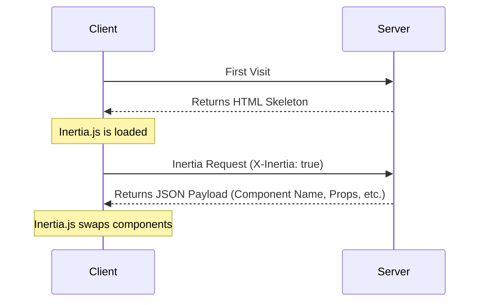

Trang này đặc tả Inertia protocol: wire contract chính xác giữa Inertia client và server của bạn. Hãy đọc trang [cách hoạt động](/v3/core-concepts/how-it-works) trước để có cái nhìn tổng quan.

Protocol không phụ thuộc framework. Bất kỳ backend nào giao tiếp qua HTTP đều có thể triển khai protocol này, vì vậy bạn có thể xây dựng server-side adapter mới bằng bất kỳ ngôn ngữ nào. Laravel adapter chính thức được dùng làm implementation tham chiếu xuyên suốt trang này, và mọi request/response bên dưới đều là ví dụ thực tế có thể copy-paste.

## Response HTML

Request đầu tiên đến một ứng dụng Inertia chỉ là request trình duyệt tải toàn bộ trang thông thường, không có header hoặc dữ liệu đặc biệt nào của Inertia. Với các request này, máy chủ trả về một tài liệu HTML đầy đủ.

HTML response này bao gồm asset của site (CSS, JavaScript) cùng một `<div>` root trong phần body. `<div>` root đóng vai trò mounting point cho ứng dụng phía client. Một phần tử `<script type="application/json">` chứa [page object](#the-page-object) được mã hóa JSON cho trang ban đầu. Inertia dùng thông tin này để khởi động client-side framework và hiển thị page component đầu tiên.

```http
REQUEST
GET: https://example.com/events/80
Accept: text/html, application/xhtml+xml

RESPONSE
HTTP/1.1 200 OK
Content-Type: text/html; charset=utf-8

<html>
    <head>
        <title>My app</title>
        <link href="/css/app.css" rel="stylesheet">
        <script src="/js/app.js" defer></script>
    </head>
    <body>
        <script data-page="app" type="application/json">{"component":"Event","props":{"errors":{},"event":{"id":80,"title":"Birthday party","start_date":"2019-06-02","description":"Come out and celebrate Jonathan's 36th birthday party!"}},"url":"\/events\/80","version":"c32b8e4965f418ad16eaebba1d4e960f"}</script>
        <div id="app"></div>
    </body>
</html>
```

<Warning>
  Page object nhúng được in bên trong thẻ `<script>`, vì vậy JSON đã serialize BẮT BUỘC phải escape mọi dấu gạch chéo (`/` thành `\/`), đó là lý do ví dụ trên chứa `"\/events\/80"`. Điều này ngăn chuỗi `</script>` nằm trong dữ liệu prop đóng thẻ script quá sớm và làm hỏng trang. KHÔNG ĐƯỢC dùng HTML entity encoding ở đây vì trình duyệt không decode entity bên trong script body, khiến việc parse JSON thất bại.
</Warning>

## Response Inertia

Sau khi ứng dụng Inertia được khởi động, mọi request tiếp theo đến website đều được thực hiện qua XHR với header `X-Inertia` đặt thành `true`. Header này cho biết request được thực hiện bởi Inertia và không phải một lần tải toàn bộ trang thông thường.

Server phát hiện header `X-Inertia` và trả JSON response chứa [page object](#the-page-object) đã mã hóa thay vì trả toàn bộ tài liệu HTML.

```http
REQUEST
GET: https://example.com/events/80
Accept: text/html, application/xhtml+xml
X-Requested-With: XMLHttpRequest
X-Inertia: true
X-Inertia-Version: 6b16b94d7c51cbe5b1fa42aac98241d5

RESPONSE
HTTP/1.1 200 OK
Content-Type: application/json
Vary: X-Inertia
X-Inertia: true

{
    "component": "Event",
    "props": {
        "errors": {},
        "event": {
            "id": 80,
            "title": "Birthday party",
            "start_date": "2019-06-02",
            "description": "Come out and celebrate Jonathan's 36th birthday party!"
        }
    },
    "url": "/events/80",
    "version": "6b16b94d7c51cbe5b1fa42aac98241d5",
    "encryptHistory": true
}
```

## Sơ đồ lifecycle của request

Sơ đồ dưới đây minh họa vòng đời request trong một ứng dụng Inertia. Lần truy cập đầu tạo request thông thường tới server, server trả về khung HTML của ứng dụng chứa root element cùng dữ liệu đã hydrate. Với các tương tác và điều hướng tiếp theo, Inertia gửi XHR request nhận về JSON. Inertia dùng response này để hydrate động và thay page component mà không cần full-page reload.



## Cách client xử lý response

Sau mỗi request, client kiểm tra response trước khi thay đổi trang. Luồng xử lý tuân theo một số quy tắc nhỏ:

- **Inertia response (`X-Inertia: true`)** được render trực tiếp: client áp dụng page object và thay component.
- **`409 Conflict` có `X-Inertia-Location`** kích hoạt full visit bằng `window.location` tới URL đó để tải asset mới. Background request được miễn khi version thay đổi, vì reload một visit mà người dùng chưa từng khởi tạo sẽ làm mất state chưa lưu.
- **`409 Conflict` có `X-Inertia-Redirect`** kích hoạt một Inertia `GET` visit mới tới URL đó.
- **Mọi response khác**, chẳng hạn tài liệu HTML, JSON thông thường hoặc trang lỗi, được xem là exception. Client phát một HTTP exception event có thể hủy và, trừ khi bạn hủy event, hiển thị error modal thay vì âm thầm điều hướng.

Các redirect `3xx` tiêu chuẩn không đi qua những quy tắc này. Trình duyệt tự động theo redirect và gửi lại request header đến location mới, vì vậy `X-Inertia` đến được redirect target và client chỉ kiểm tra response cuối cùng trong chuỗi. Xem [redirects](#redirects) để biết các status server dùng để điều khiển luồng này.

Một Inertia response hợp lệ có status `400` trở lên cũng phát cùng HTTP exception event có thể hủy trước khi render. Nếu hủy event ở đây, việc render bị chặn để bạn tự xử lý lỗi.

## Request header

Các header sau được Inertia tự động gửi khi thực hiện request. Bạn không cần thiết lập thủ công; client-side adapter của Inertia sẽ xử lý chúng.

<ParamField header="X-Inertia" type="boolean">
  Đặt thành `true` để chỉ ra đây là request Inertia.
</ParamField>

<ParamField header="X-Requested-With" type="string">
  Được đặt thành `XMLHttpRequest` trong mọi request Inertia.
</ParamField>

<ParamField header="Accept" type="string">
  Đặt thành `text/html, application/xhtml+xml` để cho biết các kiểu response
  được chấp nhận.
</ParamField>

<ParamField header="Content-Type" type="string">
  Đặt thành `application/json` cho request không chứa file upload.
</ParamField>

<ParamField header="X-Inertia-Version" type="string">
  Phiên bản asset hiện tại dùng để kiểm tra asset mismatch.
</ParamField>

<ParamField header="X-XSRF-TOKEN" type="string">
  CSRF token được đọc từ cookie `XSRF-TOKEN`. Tên cookie và header
  có thể cấu hình.
</ParamField>

<ParamField header="Purpose" type="string">
  Đặt thành `prefetch` khi thực hiện request [prefetch](/v3/data-props/prefetching).
</ParamField>

<ParamField header="X-Inertia-Partial-Component" type="string">
  Tên component dành cho [partial reload](/v3/data-props/partial-reloads).
</ParamField>

<ParamField header="X-Inertia-Partial-Data" type="string">
  Danh sách props cần đưa vào partial reload, phân tách bằng dấu phẩy.
</ParamField>

<ParamField header="X-Inertia-Partial-Except" type="string">
  Danh sách props cần loại khỏi partial reload, phân tách bằng dấu phẩy.
</ParamField>

<ParamField header="X-Inertia-Reset" type="string">
  Danh sách props cần reset khi điều hướng, phân tách bằng dấu phẩy.
</ParamField>

<ParamField header="Cache-Control" type="string">
  Đặt thành `no-cache` cho request reload để tránh phục vụ nội dung đã cũ.
</ParamField>

<ParamField header="X-Inertia-Error-Bag" type="string">
  Chỉ định error bag dùng cho [validation
  error](/v3/the-basics/validation).
</ParamField>

<ParamField header="X-Inertia-Infinite-Scroll-Merge-Intent" type="string">
  Cho biết dữ liệu được yêu cầu nên append hay prepend khi
  dùng [Infinite scroll](/v3/data-props/infinite-scroll).
</ParamField>

<ParamField header="X-Inertia-Except-Once-Props" type="string">
  Danh sách phân tách bằng dấu phẩy gồm các key [once prop](/v3/data-props/once-props) chưa hết hạn
  và đã được tải ở client. Server sẽ bỏ qua việc resolve các prop này
  trừ khi chúng được yêu cầu rõ ràng qua partial reload hoặc được force refresh
  ở phía server.
</ParamField>

Các header sau được dùng cho request validation bằng [Precognition](/v3/the-basics/forms#precognition).

<ParamField header="Precognition" type="boolean">
  Đặt thành `true` để cho biết đây là request validation Precognition.
</ParamField>

<ParamField header="Precognition-Validate-Only" type="string">
  Danh sách tên field cần validation, phân tách bằng dấu phẩy.
</ParamField>

## Response header

Các header sau được đặt trên Inertia JSON page response. Server-side adapter chính thức tự động xử lý chúng.

<ParamField header="X-Inertia" type="boolean">
  Đặt thành `true` để cho biết đây là response Inertia.
</ParamField>

<ParamField header="Vary" type="string">
  Đặt thành `X-Inertia` để giúp trình duyệt phân biệt chính xác giữa response HTML và
  JSON.
</ParamField>

Các header sau xuất hiện trên control response `409 Conflict` thay vì page response. Response `409` không mang header `X-Inertia` vì nó yêu cầu client điều hướng thay vì render trang.

<ParamField header="X-Inertia-Location" type="string">
  URL đích cho full visit bằng `window.location`. Được đặt trên external
  location visit và khi reload do asset version không khớp.
</ParamField>

<ParamField header="X-Inertia-Redirect" type="string">
  URL redirect đầy đủ, bao gồm fragment, dành cho redirect có target
  chứa URL fragment. Kích hoạt một Inertia `GET` visit mới thay vì
  full-page reload.
</ParamField>

<ParamField header="X-Inertia-Version" type="string">
  Asset version hiện tại, được echo trong response `409` do version không khớp để client
  có thể quan sát giá trị đó.
</ParamField>

Các header sau được dùng cho response validation bằng [Precognition](/v3/the-basics/forms#precognition).

<ParamField header="Precognition" type="string">
  Đặt thành `true` để cho biết đây là response validation Precognition.
</ParamField>

<ParamField header="Precognition-Success" type="string">
  Đặt thành `true` khi validation thành công và không có lỗi, kết hợp với status `204 No
  Content`.
</ParamField>

<ParamField header="Vary" type="string">
  Đặt thành `Precognition` trên mọi response khi middleware Precognition được
  áp dụng.
</ParamField>

## Page object

Inertia chia sẻ dữ liệu giữa server và client thông qua page object. Object này chứa thông tin cần thiết để render page component, cập nhật history state của trình duyệt và theo dõi asset version của site. Page object có thể bao gồm các thuộc tính sau:

<ParamField body="component" type="string">
  Tên của page component JavaScript.
</ParamField>

<ParamField body="props" type="object">
  Các page prop. Chứa toàn bộ dữ liệu của trang cùng object `errors`
  (mặc định là `{}` nếu không có lỗi).
</ParamField>

<ParamField body="url" type="string">
  URL của trang.
</ParamField>

<ParamField body="version" type="string|number">
  [Asset version](/v3/advanced/asset-versioning) hiện tại.
</ParamField>

<ParamField body="encryptHistory" type="boolean">
  Có [mã hóa history state của trang hiện tại
  hay không](/v3/security/history-encryption). Chỉ được đưa vào khi là `true`.
</ParamField>

<ParamField body="clearHistory" type="boolean">
  Có xóa [encrypted history
  state](/v3/security/history-encryption#clearing-history) hay không. Chỉ được đưa vào khi là `true`.
</ParamField>

<ParamField body="preserveFragment" type="boolean">
  Có [giữ URL fragment](/v3/the-basics/redirects#preserving-fragments) của request ban đầu qua redirect hay không.
</ParamField>

<ParamField body="mergeProps" type="array">
  Mảng các key prop cần được [gộp](/v3/data-props/merging-props)
  (append) trong quá trình điều hướng.
</ParamField>

<ParamField body="prependProps" type="array">
  Mảng các key prop cần được [prepend](/v3/data-props/merging-props)
  trong quá trình điều hướng.
</ParamField>

<ParamField body="deepMergeProps" type="array">
  Mảng các key prop cần được [deep
  merge](/v3/data-props/merging-props#deep-merge) trong quá trình điều hướng.
</ParamField>

<ParamField body="matchPropsOn" type="array">
  Mảng các key prop dùng để [khớp phần tử khi gộp
  prop](/v3/data-props/merging-props#matching-items).
</ParamField>

<ParamField body="scrollProps" type="object">
  Cấu hình hành vi gộp prop cho [infinite scroll](/v3/data-props/infinite-scroll).
  hành vi merge.
</ParamField>

<ParamField body="deferredProps" type="object">
  Cấu hình cho việc [lazy-load
  prop](/v3/data-props/deferred-props) phía client.
</ParamField>

<ParamField body="rescuedProps" type="array">
  Mảng key [deferred prop](/v3/data-props/deferred-props#error-handling)
  không resolve thành công và đã được rescue phía server. Client dùng danh sách này để
  render slot `rescue` trên component `<Deferred>`.
</ParamField>

<ParamField body="sharedProps" type="array">
  Mảng key prop cấp cao nhất được đăng ký qua `Inertia::share()`. Client dùng chúng để
  mang shared prop sang trong [instant
  visit](/v3/the-basics/instant-visits).
</ParamField>

<ParamField body="onceProps" type="object">
  Cấu hình cho [once props](/v3/data-props/once-props), là các prop chỉ nên được
  resolve một lần rồi tái sử dụng ở các trang sau. Mỗi entry ánh xạ một key tới
  object chứa tên `prop` và timestamp `expiresAt` tùy chọn (tính bằng
  millisecond).
</ParamField>

<ParamField body="flash" type="object">
  Flash session data của request hiện tại. Chỉ được đưa vào khi có flash data.
  Client cung cấp dữ liệu này qua event `inertia:flash` và loại bỏ nó
  khỏi history state được lưu bền vững.
</ParamField>

Chỉ `component`, `props`, `url` và `version` luôn có mặt trên mọi page object, vì vậy một page object tối thiểu có dạng sau:

```json
{
  "component": "User/Edit",
  "props": {
    "errors": {},
    "user": {
      "name": "Jonathan"
    }
  },
  "url": "/user/123",
  "version": "6b16b94d7c51cbe5b1fa42aac98241d5"
}
```

Các field metadata còn lại là có điều kiện, chỉ được phát ra khi hành vi prop tương ứng áp dụng. Field vắng mặt mặc định ở client thành mảng rỗng, object rỗng hoặc `false`, vì vậy server có thể bỏ field rỗng hoặc phát rõ field đó mà kết quả vẫn tương đương.

## Mô hình đánh giá prop

Mỗi prop server trả về thuộc một hoặc nhiều nhóm. Nhóm đó quyết định prop có được resolve cho request cụ thể hay không và page object mang metadata nào, nếu có, để mô tả nó. Các quy tắc này hoàn toàn là vấn đề resolve ở phía server; client chỉ áp dụng metadata mà nó nhận được.

Cách resolve khác nhau giữa hai chế độ request. Full visit resolve toàn bộ tập prop đủ điều kiện. Partial reload chỉ resolve những prop client yêu cầu, dựa trên page component.

**Full visit**

| Nhóm prop                     | Có resolve?                               | Metadata được phát                                              |
| :--------------------------- | :--------------------------------------- | :------------------------------------------------------------- |
| Thông thường                 | Có                                       | không                                                          |
| Always                       | Có (không bị ảnh hưởng bởi `only`/`except`) | không                                                       |
| Optional                     | Không (không resolve, không công bố)     | không                                                          |
| Deferred                     | Không (chỉ công bố)                      | `deferredProps`                                                |
| Merge / deep merge / prepend | Có                                       | `mergeProps`, `deepMergeProps`, `prependProps`, `matchPropsOn` |
| Once                         | Có, trừ khi client đã ghi nhớ            | `onceProps`                                                    |
| Scroll                       | Có                                       | `scrollProps`, `mergeProps`                                    |

**Partial reload**

| Nhóm prop                     | Có resolve?                               | Metadata được phát                                              |
| :--------------------------- | :--------------------------------------- | :------------------------------------------------------------- |
| Thông thường                 | Chỉ khi được yêu cầu qua `only`/`except` | không                                                          |
| Always                       | Có (không bị ảnh hưởng bởi `only`/`except`) | không                                                       |
| Optional                     | Chỉ khi được chọn qua `only`/`except`    | không                                                          |
| Deferred                     | Chỉ khi được chọn qua `only`/`except`    | `rescuedProps` (khi rescue)                                    |
| Merge / deep merge / prepend | Khi được resolve                         | `mergeProps`, `deepMergeProps`, `prependProps`, `matchPropsOn` |
| Once                         | Luôn resolve khi được yêu cầu (bỏ qua except-once) | `onceProps`                                          |
| Scroll                       | Khi được resolve                         | `scrollProps`, `mergeProps`                                    |

Một số field metadata chỉ áp dụng cho từng chế độ cụ thể:

- `deferredProps` chỉ được điền trong full visit. Nó rỗng hoặc không tồn tại ở partial reload vì deferred prop được resolve trong request tiếp theo.
- `rescuedProps` chỉ được điền trong partial reload, liệt kê các deferred prop không resolve thành công.
- Metadata merge, scroll và once được phát theo từng response, cùng với những prop mang các hành vi đó.

### Always props

Always prop được resolve trong mọi response ở cả hai chế độ. Chúng hoàn toàn bỏ qua filter partial reload, vì vậy một always prop vẫn được gửi kể cả khi request liệt kê nó trong `except`. Chúng không mang page-object metadata vì đây thuần túy là quy tắc resolve phía server. Prop `errors` là một always prop, đó là lý do mọi page object đều có object `errors`.

### Kết hợp các nhóm

Một prop có thể đồng thời thuộc nhiều nhóm. Prop có thể vừa deferred vừa mergeable, vừa once vừa deferred, hoặc vừa scroll vừa deferred. Các field metadata độc lập với nhau, vì vậy page object mang mọi nhãn áp dụng, tùy theo chế độ, partial filter và các quy tắc reset ở trên.

## Tải lại một phần

Tùy chọn partial reload cho phép bạn yêu cầu một tập con của props (dữ liệu) từ server trong các lần truy cập tiếp theo tới _cùng_ page component. Đây có thể là tối ưu hiệu năng hữu ích nếu chấp nhận một phần dữ liệu trang có thể bị cũ. Xem tài liệu [partial reloads](/v3/data-props/partial-reloads) để biết chi tiết.

Request partial reload chứa header `X-Inertia-Partial-Component` và có thể kèm các header `X-Inertia-Partial-Data` và/hoặc `X-Inertia-Partial-Except`.

Header `X-Inertia-Partial-Data` là danh sách phân tách bằng dấu phẩy các key props (dữ liệu) cần được trả về.

Header `X-Inertia-Partial-Except` là danh sách phân tách bằng dấu phẩy các key props (dữ liệu) không nên được trả về. Nếu chỉ gửi `X-Inertia-Partial-Except`, server gửi mọi prop trừ các prop được liệt kê. Có thể gửi cả hai header cùng lúc; khi đó danh sách `X-Inertia-Partial-Data` thu hẹp response trước, rồi danh sách `X-Inertia-Partial-Except` được loại khỏi kết quả, vì vậy prop xuất hiện trong cả hai sẽ bị loại.

Header `X-Inertia-Partial-Component` chứa tên component đang được partial reload. Điều này là bắt buộc vì partial reload chỉ hoạt động với request tới cùng page component. Nếu đích cuối cùng thay đổi vì lý do nào đó (ví dụ người dùng đã đăng xuất và giờ ở trang đăng nhập), partial reload sẽ không diễn ra.

```http
REQUEST
GET: https://example.com/events
Accept: text/html, application/xhtml+xml
X-Requested-With: XMLHttpRequest
X-Inertia: true
X-Inertia-Version: 6b16b94d7c51cbe5b1fa42aac98241d5
X-Inertia-Partial-Data: events
X-Inertia-Partial-Component: Events

RESPONSE
HTTP/1.1 200 OK
Content-Type: application/json

{
    "component": "Events",
    "props": {
        "events": [...], // the requested prop
        "errors": {}     // always included
    },
    "url": "/events/80",
    "version": "6b16b94d7c51cbe5b1fa42aac98241d5"
}
```

### Reset props

Header `X-Inertia-Reset` liệt kê các path prop mà client muốn reset trước khi áp dụng dữ liệu mới. Prop bị reset sẽ được resolve lại và trả về không có nhãn, có mặt trong `props` nhưng vắng khỏi mọi mảng merge, vì vậy client thay thế giá trị thay vì gộp vào nó. Client gửi reset path trong cả header `X-Inertia-Reset` và danh sách `only`. Với scroll prop, server còn đặt `scrollProps[path].reset` trong metadata; component [infinite scroll](/v3/data-props/infinite-scroll) dùng giá trị này để đồng bộ lại trạng thái phân trang với trang được trả về. Xem [resetting props](/v3/data-props/merging-props#resetting-props) để biết API phía client.

## Deferred và optional props

Deferred prop cho phép server công bố dữ liệu sẽ được tải trong request tiếp theo. Trong full visit, prop bị bỏ qua và key được liệt kê trong `deferredProps`, theo nhóm request mà nó thuộc về. Client gửi một partial reload cho mỗi nhóm để lấy dữ liệu; tên nhóm có thể tùy ý. Xem tài liệu [deferred props](/v3/data-props/deferred-props).

```json
{
  "component": "Posts/Index",
  "props": {
    "errors": {},
    "user": {
      "name": "Jonathan"
    }
  },
  "url": "/posts",
  "version": "6b16b94d7c51cbe5b1fa42aac98241d5",
  "deferredProps": {
    "default": ["comments", "analytics"],
    "sidebar": ["relatedPosts"]
  }
}
```

Optional prop hoạt động tương tự nhưng không bao giờ được công bố. Chúng bị bỏ qua ở full visit và chỉ resolve khi partial reload chọn chúng qua `only` hoặc `except`.

### Deferred props được rescue

Một deferred prop được resolve với `rescue: true` mà ném exception sẽ không làm response thất bại; response vẫn là `200` và chứa mọi prop khác. Server báo exception qua cơ chế xử lý lỗi của framework, loại hoàn toàn prop khỏi `props` (không gửi dưới dạng `null`) và thêm key của nó vào mảng top-level `rescuedProps`. Client dùng danh sách này để render slot `rescue` trên component `<Deferred>`. Xem [xử lý lỗi](/v3/data-props/deferred-props#error-handling).

```json
{
  "component": "Users/Index",
  "props": {
    "errors": {}
  },
  "url": "/users",
  "version": "6b16b94d7c51cbe5b1fa42aac98241d5",
  "rescuedProps": ["permissions"]
}
```

## Gộp props

Merge prop yêu cầu client kết hợp dữ liệu prop mới với dữ liệu đã có trên trang thay vì thay thế. Mảng được append hoặc prepend, còn object được shallow merge hoặc deep merge. Page object đánh dấu mỗi prop cần gộp trong `mergeProps` (append), `prependProps` (prepend) hoặc `deepMergeProps` (deep merge). Việc gộp chỉ áp dụng cho partial reload, vì vậy full visit luôn thay thế prop kể cả khi prop mang nhãn merge. Xem tài liệu [merging props](/v3/data-props/merging-props).

```json
{
  "component": "Feed/Index",
  "props": {
    "errors": {},
    "user": {
      "name": "Jonathan"
    },
    "posts": [
      {
        "id": 1,
        "title": "First Post"
      }
    ],
    "notifications": [
      {
        "id": 2,
        "message": "New comment"
      }
    ],
    "conversations": {
      "data": [
        {
          "id": 1,
          "title": "Support Chat",
          "participants": ["John", "Jane"]
        }
      ]
    }
  },
  "url": "/feed",
  "version": "6b16b94d7c51cbe5b1fa42aac98241d5",
  "mergeProps": ["posts"],
  "prependProps": ["notifications"],
  "deepMergeProps": ["conversations"],
  "matchPropsOn": ["posts.id", "notifications.id", "conversations.data.id"]
}
```

### Khớp phần tử

Mảng `matchPropsOn` cho client biết field nào định danh từng phần tử để entry hiện có có thể được cập nhật tại chỗ thay vì bị nhân bản. Mỗi entry có dạng `"<propPath>.<keyField>"` và được tách tại dấu chấm cuối cùng: phần trước segment cuối là prop path, segment cuối là key field. `conversations.data.id` định danh mảng tại `conversations.data` theo field `id`. Xem [matching items](/v3/data-props/merging-props#matching-items).

## Once props

Once prop được resolve một lần và client ghi nhớ, sau đó tái sử dụng ở các trang tiếp theo có cùng prop. Page object mang cấu hình `onceProps`. Mỗi entry ánh xạ một key tới tên prop và timestamp hết hạn tùy chọn tính bằng millisecond. Xem tài liệu [once props](/v3/data-props/once-props).

```json
{
  "component": "Billing/Plans",
  "props": {
    "errors": {},
    "plans": [
      {
        "id": 1,
        "name": "Basic"
      },
      {
        "id": 2,
        "name": "Pro"
      }
    ]
  },
  "url": "/billing/plans",
  "version": "6b16b94d7c51cbe5b1fa42aac98241d5",
  "onceProps": {
    "plans": {
      "prop": "plans",
      "expiresAt": null
    }
  }
}
```

Trong các request Inertia tiếp theo, client gửi các once key đã tải và chưa hết hạn trong header `X-Inertia-Except-Once-Props`. Server bỏ qua việc resolve các prop đó và không đưa chúng vào response; client tái sử dụng giá trị đã tải trước đó.

```http
REQUEST
GET: https://example.com/billing/upgrade
Accept: text/html, application/xhtml+xml
X-Requested-With: XMLHttpRequest
X-Inertia: true
X-Inertia-Version: 6b16b94d7c51cbe5b1fa42aac98241d5
X-Inertia-Except-Once-Props: plans

RESPONSE
HTTP/1.1 200 OK
Content-Type: application/json

{
    "component": "Billing/Upgrade",
    "props": {
        "errors": {},
        "currentPlan": {
            "id": 1,
            "name": "Basic"
        }
    },
    "url": "/billing/upgrade",
    "version": "6b16b94d7c51cbe5b1fa42aac98241d5",
    "onceProps": {
        "plans": {
            "prop": "plans",
            "expiresAt": null
        }
    }
}
```

Lưu ý `plans` có trong `onceProps` nhưng không có trong `props` vì nó đã được tải ở client. Key `onceProps` định danh once prop xuyên trang, còn `prop` chỉ định tên prop thực tế. Hai giá trị này có thể khác nhau khi dùng [custom key](/v3/data-props/once-props#custom-keys).

### Force-fresh và partial reload

Server có thể gửi giá trị mới cho once prop kể cả khi key của nó xuất hiện trong `X-Inertia-Except-Once-Props`, ví dụ khi dữ liệu nền đã thay đổi. Giá trị trả về cùng `expiresAt` mới sẽ thay thế bản sao ở client. Trong partial reload, header except-once bị bỏ qua, vì vậy once prop được yêu cầu luôn được resolve.

## Infinite scroll

Infinite scroll xây dựng trên merge prop. Mảng bên trong của prop được đánh dấu để gộp (thường là `<path>.data`), còn page object mang entry `scrollProps` mô tả cursor của paginator. Xem tài liệu [infinite scroll](/v3/data-props/infinite-scroll).

```json
{
  "component": "Posts/Index",
  "props": {
    "errors": {},
    "posts": {
      "data": [
        {
          "id": 1,
          "title": "First Post"
        },
        {
          "id": 2,
          "title": "Second Post"
        }
      ]
    }
  },
  "url": "/posts?page=1",
  "version": "6b16b94d7c51cbe5b1fa42aac98241d5",
  "mergeProps": ["posts.data"],
  "scrollProps": {
    "posts": {
      "pageName": "page",
      "previousPage": null,
      "nextPage": 2,
      "currentPage": 1,
      "reset": false
    }
  }
}
```

Mỗi scroll response đều phát lại nhãn merge và một cursor mới. Request reset còn đặt `scrollProps[path].reset` thành `true`, báo cho client đồng bộ lại trạng thái phân trang theo page được trả về. Deferred scroll prop không phát `scrollProps` trong full visit vì nó được resolve ở request tiếp theo.

## Quản lý phiên bản asset

Page object mang định danh `version` đại diện cho phiên bản asset hiện tại của site. Giá trị có thể là số, chuỗi hoặc file hash, miễn là thay đổi khi asset thay đổi; server không theo dõi asset version nên gửi chuỗi rỗng. Client gửi lại version của page đang hoạt động trong header `X-Inertia-Version`, còn server so sánh hai giá trị, thường ở lớp middleware.

Nếu version khớp, request tiếp tục bình thường. Nếu không khớp trên request `GET`, server lập tức trả `409 Conflict` với URL đích trong header `X-Inertia-Location` và version hiện tại trong `X-Inertia-Version`, giúp client đến đúng đích kể cả sau server-side redirect. Request không phải `GET` không bao giờ nhận `409` do version mismatch, dù request `GET` sau redirect vẫn có thể nhận. Server-side adapter cũng reflash mọi flash session data trên `409` để dữ liệu tồn tại qua request tiếp theo.

```http
REQUEST
GET: https://example.com/events/80
Accept: text/html, application/xhtml+xml
X-Requested-With: XMLHttpRequest
X-Inertia: true
X-Inertia-Version: 6b16b94d7c51cbe5b1fa42aac98241d5

RESPONSE
409: Conflict
X-Inertia-Location: https://example.com/events/80
X-Inertia-Version: 2f8a1c9e4b7d0a3f6c5e8b1d4a7f0c2e
```

Xem trang [asset versioning](/v3/advanced/asset-versioning) để biết cách cấu hình version và cách background request được xử lý.

## Redirect

Inertia dựa vào HTTP redirect tiêu chuẩn để điều hướng sau một thao tác phía server. `302 Found` được trả về sau request `PUT`, `PATCH` hoặc `DELETE` sẽ được chuyển thành `303 See Other` để trình duyệt gửi `GET` tới redirect target, tránh lặp lại request không phải GET.

External redirect trỏ ra ngoài ứng dụng Inertia, nơi các request header của Inertia không thể đi theo, vì vậy XHR visit có thể không follow được. Thay vào đó server trả `409 Conflict` cùng header `X-Inertia-Location`, và client thực hiện full visit bằng `window.location`.

Redirect không phải prefetch có target chứa URL fragment được trả về dưới dạng `409 Conflict` với header `X-Inertia-Redirect` chứa URL đầy đủ, sau đó client thực hiện Inertia `GET` visit mới tới URL đó. Cơ chế này khác field `preserveFragment` của page object, vốn mang fragment của request ban đầu qua redirect thông thường. Xem tài liệu [redirects](/v3/the-basics/redirects).

## Lỗi validation

Validation error được chia sẻ qua prop `errors`. Laravel adapter đăng ký `errors` là always prop nên nó có mặt trong mọi page object và mặc định là `{}` khi không có lỗi.

Mỗi key có thể ánh xạ tới một message hoặc một mảng message, và client render đúng shape nhận được. Việc chọn shape thuộc về server; vì vậy Laravel adapter mặc định gửi lỗi đầu tiên của mỗi field và có thể được [cấu hình](/v3/the-basics/validation#multiple-errors-per-field) để gửi toàn bộ error message cho từng field.

Request có thể scope error vào một error bag có tên bằng header `X-Inertia-Error-Bag`. Server namespace các error được trả về dưới bag đó, nhờ vậy nhiều form trên cùng trang có thể giữ lỗi riêng biệt. Xem tài liệu [validation](/v3/the-basics/validation).

## HTTP status code

Inertia sử dụng các HTTP status code cụ thể để xử lý những tình huống khác nhau.

| Status code        | Mô tả                                                                                                                                                                                                                                                                |
| :---------------- | :-------------------------------------------------------------------------------------------------------------------------------------------------------------------------------------------------------------------------------------------------------------------- |
| **200 OK**        | Response thành công tiêu chuẩn cho cả HTML và Inertia JSON response.                                                                                                                                                                                                 |
| **302 Found**     | Redirect response tiêu chuẩn.                                                                                                                                                                                                                                        |
| **303 See Other** | Status redirect sau request không phải GET, yêu cầu trình duyệt follow bằng `GET`. Xem [redirects](#redirects).                                                                                                                                                       |
| **409 Conflict**  | Control response thay vì page, dùng cho [asset version mismatch](#asset-versioning), external redirect hoặc fragment redirect. Xem [redirects](#redirects).                                                                                                         |

Các status code sau được dùng cho request validation bằng [Precognition](/v3/the-basics/forms#precognition).

| Status code                   | Mô tả                                                                                         |
| :--------------------------- | :--------------------------------------------------------------------------------------------- |
| **204 No Content**           | Request Precognition validation thành công và không có validation error.                       |
| **422 Unprocessable Entity** | Request Precognition validation có validation error. Response body chứa các lỗi.               |

## Server-side rendering

Mặc định Inertia không server-side render page component. Khi bật [SSR](/v3/advanced/server-side-rendering), một wire contract thứ hai được đưa vào, lần này giữa server-side adapter và Node SSR server của Inertia. Adapter POST page object tới SSR server; server này trả markup đã pre-render cho tài liệu HTML.

```http
REQUEST
POST: http://127.0.0.1:13714/render
Content-Type: application/json

{"component":"Event","props":{"errors":{},"event":{"id":80,"title":"Birthday party"}},"url":"/events/80","version":"c32b8e4965f418ad16eaebba1d4e960f"}

RESPONSE
HTTP/1.1 200 OK
Content-Type: application/json
Server: Inertia.js SSR

{"head":["<title>Birthday party<\/title>"],"body":"<script data-page=\"app\" type=\"application\/json\">{\"component\":\"Event\",...}<\/script><div data-server-rendered=\"true\" id=\"app\"><h1>Birthday party<\/h1><\/div>"}
```

Response điền vào hai slot của root template, được Laravel adapter cung cấp dưới dạng Blade component `<x-inertia::head>` và `<x-inertia::app>`. Mảng `head` chứa các phần tử thuộc `<head>` của tài liệu, chẳng hạn title và meta tag. Chuỗi `body` thay thế page object script tag và root `<div>` mà tài liệu không SSR sẽ render, vì SSR server đã đưa cả hai vào markup; nó còn mang `data-server-rendered="true"` để client hydrate DOM hiện có thay vì mount ứng dụng mới. Việc escape dấu gạch chéo trong page object nhúng do SSR server xử lý, nên adapter có thể in markup `body` nguyên trạng.

SSR server cung cấp thêm hai endpoint. Request `GET` tới `/health` trả `{"status":"OK"}` và có thể dùng để xác minh process đang chạy trước khi gửi render. Request `POST` tới `/shutdown` dừng process; đây là cách command `inertia:stop-ssr` của Laravel adapter hoạt động.

Render thất bại trả response `500` với JSON body phân loại lỗi thay vì chỉ báo lỗi chung.

```json
{
  "error": "window is not defined",
  "type": "browser-api",
  "component": "Events/Show",
  "url": "/events/80",
  "browserApi": "The global window object",
  "hint": "The global window object doesn't exist in Node.js. Wrap browser-specific code in a lifecycle hook...",
  "stack": "ReferenceError: window is not defined\n    at ...",
  "sourceLocation": "resources/js/Pages/Events/Show.vue:14:3",
  "timestamp": "2026-03-14T09:21:44.512Z"
}
```

Message `error`, `hint` và `timestamp` luôn có mặt, còn `component`, `url`, `stack` và `sourceLocation` xuất hiện khi SSR server có thể xác định. `type` thu hẹp nguyên nhân thành `browser-api` nếu một browser global bị truy cập trong lúc render, đồng thời đặt `browserApi` thành API gây lỗi; `component-resolution` nếu không resolve được page component; hoặc `render` với các exception khác do component ném ra.

Adapter nên xem render thất bại là lỗi không fatal: báo payload qua error handling của ứng dụng rồi fallback về tài liệu client-side rendered tiêu chuẩn, để SSR build lỗi không làm site ngừng hoạt động. Laravel adapter phát lỗi này thành [`SsrRenderFailed` event](/v3/advanced/server-side-rendering#error-handling) và bổ sung type `connection` riêng khi hoàn toàn không kết nối được tới SSR server.

---

## Tài liệu chính thức

Bài dịch này được đối chiếu từ [tài liệu Inertia.js v3 chính thức](https://inertiajs.com/docs/v3/core-concepts/the-protocol). Nếu có khác biệt do phiên bản hoặc cập nhật mới, hãy ưu tiên tài liệu chính thức làm nguồn tham chiếu.
